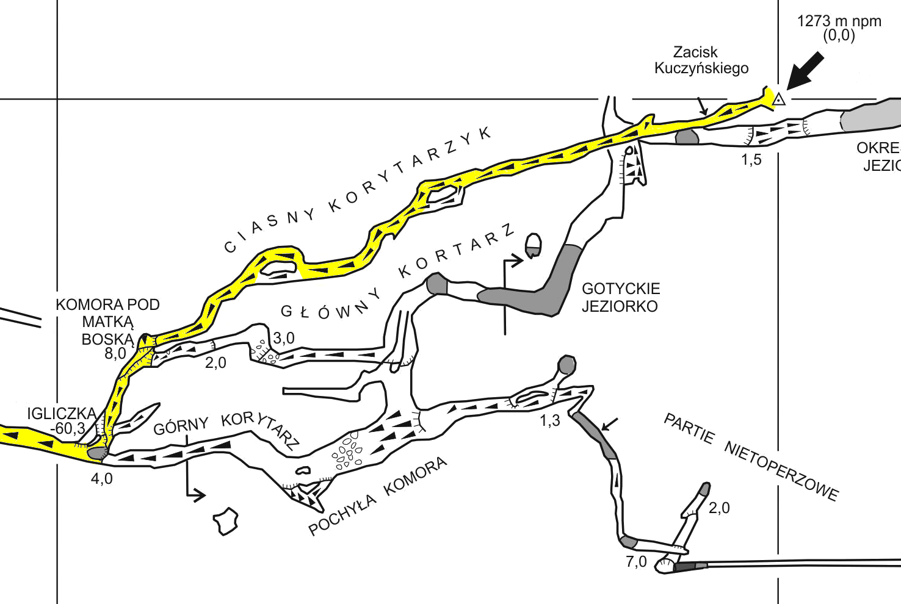
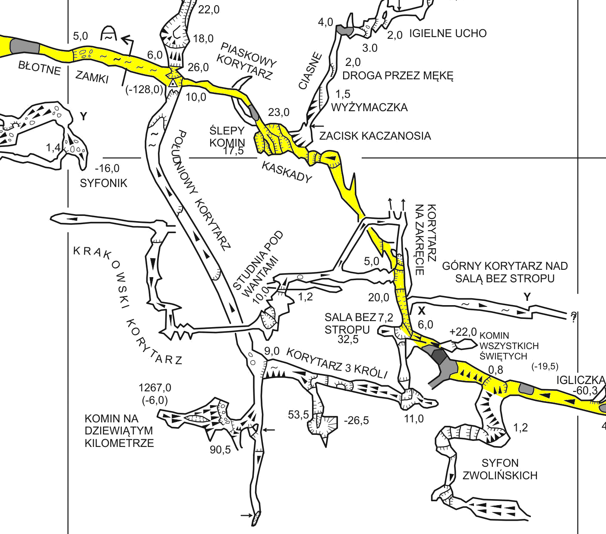
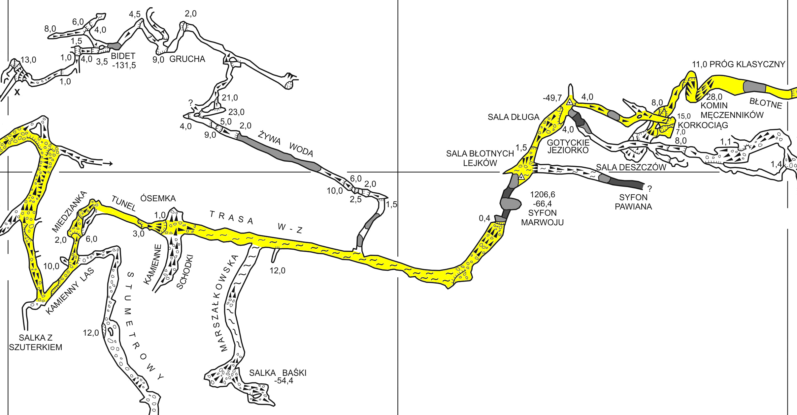

# Jaskinia Miętusia

__Opis na podstawie danych Państwowy Instytut Geologiczny - Państwowy Instytut Badawczy__

__Mini plany na podstawie danych Państwowy Instytut Geologiczny - Państwowy Instytut Badawczy__
__Autorzy: J. Grodzicki, W. Bolek, K. Starnawski, R. Kardaś oraz Zespół Inwentaryzacji Jaskiń Tatrzańskich PTPNoZ__

Drobne zmiany opisu i redakcje (CC BY SA 4.0) wykonał Radost Waszkiewicz - Speleoklub Warszawski

Opis ciągu głownego normalnym tekstem, _boczne partie italiką_, rzadko odwiedzane partie zwinięte w blokach.

-----------------------------------------------------------------

## Otwór

Niepozorny otwór jaskini o wymiarach 0,6x0,8 m ukryty jest w zagłębieniu pod skałą. W roku 1976 zainstalowano w nim kratę, która obecnie już nie istnieje. 

## Rura

<figure class="inline end" markdown>
  {width="400", align=left}
  <figcaption>Mini plan: Partie wejściowe - kratka 100m</figcaption>
</figure>

Za otworem ciągnie się Ciasny Korytarzyk o długości 118 m, uciążliwy ze względu na ciasnotę (cały czas posuwać się nim można tylko na czworakach), liczne zaciski. Doprowadza on nad 8 m wysoki, pochyły próg, którym schodzimy przy pomocy poręczówki do Komory Matki Boskiej (trudności progu IV-). Stąd w dół i w lewo. 

_Dalej w górę ciągnie się Główny Korytarz – obszerny chodnik o szerokości 1,5–2 m i wysokości kilku metrów._

??? "Główny Korytarz – część górna"
    W lewo, stromo w górę idziemy po skalistym, wymytym przez wodę dnie przez kilka zakrętów pokonując po drodze próg 3 m wysokości (IV) i dochodzimy do zajmującego całą szerokość Głównego Korytarza jeziorka o długości około 7 m i głębokości około 1,4 m. Za jeziorkiem, po kilkudziesięciu metrach dochodzimy do blokującego korytarz zawaliska Wantul. Stąd do powierzchni według pomiarów radiolokacyjnych jest około 8 m (Gamdzyk, Onyszkiewicz 1960, 1962).

Od Komory pod Matką Boską idziemy Głównym Korytarzem w dół. Po kilku metrach dochodzimy do Iglicy – 3 m wysokiego progu. 

Z prawej orograficznie strony Iglicy można ominąć prożek szczeliną. U podnóża Iglicy Główny Korytarz skręca pod kątem prostym w prawo, na zakręcie jego dno pokrywa płytkie jeziorko. 

_Z tego miejsca w lewo, w górę poprzez 5 m wysoki próg (IV) możemy się wycofać do Górnego Korytarza. Jest on rozwinięty na tych samych szczelinach co dalszy ciąg Głównego Korytarza. Górny Korytarz ładnie myty przez wodę, o skalnym dnie i nielicznych, pięknych naciekach, doprowadza do Pochyłej Komory, bardzo szerokiej (około 6 m), niskiej (około 0,8 m), o dnie zasłanym gruzem, a w górnej części namuliskiem. Pochyła Komora w swej górnej części kończy się dwoma niewielkimi studniami opadającymi do Głównego Korytarza przed jeziorkiem. Nieco wcześniej można wspiąć się lewą orograficznie ścianą Komory do wznoszącego się stromo w górę korytarza prowadzącego do tzw. Partii Nietoperzowych. Zmienia on kilkakrotnie kierunek. Na odcinkach poziomych w dwóch miejscach zbiera się woda (zwykle przejście wymaga jej wyczerpania). Nieco dalej, na zakręcie korytarza trafiamy na głębsze jeziorko, tworzące często syfon. Po częściowym wyczerpaniu wody czołgamy się kilka metrów w błocie niską, ciasną rurką i za zakrętem schodzimy śliską, 7-metrową studzienką (przydatna lina). Z jej dna przez ciasny syfonik można przejść na bezdechu do wąskiej szczeliny, która kontynuuje się około 30 m i jest zakończona zwężeniem. Przed syfonikiem 1-metrowy prożek prowadzi w górę do krótkiego korytarzyka opadającego prożkami do syfonu wysychającego tylko wyjątkowo, w okresach optymalnych warunków wodnych w jaskini. Korytarz za syfonem nie został zbadany._

## Syfon Zwolińskich

<figure class="inline end" markdown>
  {width="400", align=left}
  <figcaption>Mini plan: Błotne Zamki - kratka 100m</figcaption>
</figure>

Od Iglicy Główny Korytarz opada w dół i po dwudziestu metrach skręca w lewo kończąc się Syfonem Zwolińskich. 

??? "Syfon Zwolińskich – partie pod wodą"
    Syfon ten poznany został na długości około 65 m. Jego dokładna dokumentacja znajduje się w pracy J. Grodzickiego i M. Sygowskiego (1971). Początkowy, wysoki (3–4 m) i obszerny (2–3 m) korytarz opada następnie stromo w dół przez 9 drewnianych tam wzniesionych w jego dnie przez Zwolińskich. Odcinek ten (poniżej II tamy) jest znacznie ciaśniejszy (wysokość 0,4–1,2 m, szerokość 0,3–1,5 m), prawdopodobnie odkopane tu zostało jedynie koryto stropowe korytarza syfonu, który w znacznej swej części wypełniony jest namuliskiem. Zwykle wypełniony jest on wodą, a częściowo – błotem. Za lekkim przegięciem syfonu, zwanym Żąpiem, strop wznosi się, a po kilku metrach opada (tamy X i XI), doprowadzając do przegięcia – tzw. Zęba. Za Zębem wznosi się korytarz o wysokości 0,5 m i szerokości 4–5 m, o łukowatym stropie. W końcowej części istnieje prześwit między namuliskiem a stropem – jednak znikomy (kilka cm). W całym syfonie strop pokrywają zagłębienia wirowe. Syfon wypełniony jest wodą – w zimie jej poziom sięga zwykle pod II tamę, a jego eksploracja wymaga zaangażowania dużego zespołu do pompowania wody i wybierania namuliska.

Główny ciąg za wejściem do Syfonu Zwolińskich kontynuuje się w górę w przedłużeniu Głównego Korytarza. Poprzez mały, połogi prożek dochodzimy do Wiszącego Syfoniku, który należy opróżnić przelewając wodę do Syfonu Zwolińskich. Przeczołgujemy się przez obniżenie u wylotu Wiszącego Syfoniku i wchodzimy do Sali bez Stropu. Sala ta rozwinięta jest na pionowej szczelinie o kierunku zbliżonym do N–S. 

### _Partie nad Salą Bez Stropu_

_Główny ciąg kontynuuje się na wprost, natomiast w południowym jej odgałęzieniu możemy wspiąć się 15 m w górę (IV) ciasną zapieraczką, na platformę. Z platformy ku W opada stromo w dół obszerny Korytarz Trzech Króli o skalistym, pokrytym cienką warstwą błota dnie. Pochylnią z pionowymi spiętrzeniami zjeżdżamy, a później schodzimy nad krawędź 9-metrowego progu, sprowadzającego do Południowego Korytarza, po drodze mijając odchodzący w lewo trawers do zasłanej gruzem i blokami salki u podnóża obszernego komina. Komin ten (V+ do VI-, A1) kończy się ślepo na wysokości 53,5 m od podstawy (–26,5 m w stosunku do otworu). Na wysokości 10 m odchodzi od komina rozwinięta na tej samej szczelinie studzienka o głębokości 14 m._

#### _Do Komina Za Zaciskiem_

_Od platformy nad Korytarzem Trzech Króli wspinamy się 12 m (IV+) w górę i poprzez okienko wracamy do szczeliny Sali bez Stropu (komin nad okienkiem kontynuuje się jeszcze około 15 m i zwęża się w niedostępną szczelinę). Od okienka trawersujemy szczelinę Sali bez Stropu kilkanaście metrów skośnie w górę do Wiszącej Salki. Ponad wejściem do niej wznosi się 30 m wysokości Komin Wszystkich Świętych (IV). W jego stropie, przez zacisk można dostać się do Komina za Zaciskiem. Liczy on łącznie 32 m, lecz 13 m nad dnem osiągamy (trudności IV, V) półkę, dzielącą go na dwie części. Dalsza wspinaczka zwężającym się kominem doprowadza do najwyższego miejsca jaskini (+22 m względem otworu). Osiągamy niepokonane zwężenie w stropie, za którym widać niewiele szerszą, ale dostępną dla człowieka szczelinę o dnie wysłanym rumoszem i dalszą jej kontynuację w górę._

#### _Do Górnego Komina_

_Wracamy do Wiszącej Salki. Wspinamy się jej zachodnią ścianą na oryginalne skalne ostrze, którym docieramy do otwartej szczeliny. W dół, po drugiej stronie ostrza, znajduje się około 20 m głęboka Szczelina za Brzytwą. Dalej wspinamy się zapieraczką (III) i dochodzimy na zaklinowaną, ruchomą wantę. W tym miejscu mamy trzy możliwości – szczeliną na wprost trafimy do Krakowskiego Korytarza, wstecz do góry osiągamy podnóże Górnego Komina, natomiast w górze w prawo, około 50 m nad dnem Sali bez Stropu, odgałęzia się krótki, około 25 m długości, Górny Korytarz. Dostajemy się do niego wspinając się 4,5 m nieco wstecz szczeliną na zaklinowane wanty (III), a następnie przez 2,5 m wysokości prożek (V+). Jest to korytarz o owalnym przekroju, osiągający wysokość –13,7 m względem otworu. Występuje tu drobno laminowane namulisko mułkowo-ilaste, rozmywane przez okresowo płynącą wodę, stanowiące w końcowej części korytarza jego lewą ścianę, spąg i strop. Korytarz kończy się niedostępnym, wymytym przez wodę prześwitem w namulisku, z którego wyczuwa się wyraźny, choć słaby, przewiew. Wymycia w ścianach korytarza wskazują na kierunek przepływu wody ku Sali bez Stropu. W korytarzu występują dwie generacje nacieków. Zimują tu nietoperze i muchówki._

_Od zaklinowanej, ruchomej wanty możemy także wspiąć się wstecz w kierunku Wiszącej Salki. Po kilku metrach zapieraczki wychodzimy w górę na platforemkę z zaklinowanych want, stanowiącą dno niewielkiej salki. Ponad nią wznosi się stromy Górny Komin (V, V+, III), klinujący się na wysokości +7,2 m względem otworu jaskini._

#### _Do Studni pod Wantami_

_Od ruchomej wanty w szczelinie, gdzie rozchodzą się drogi, trawersujemy wprost kilka metrów do korytarza. Nieco dalej szczelina się zwęża. Stąd przez 1,4-metrowy prożek skręcamy w lewo do Krakowskiego Korytarza. Biegnie on ku zachodowi. Po około 20 metrach, w dnie pod dużą wantą znajduje się niezwykle ciasny otwór. Prowadzi on do głębokiej na około 10 m Studni pod Wantami. Z jej dna niski przełaz prowadzi nad 4-metrowy próg, nad którym przerwano eksplorację. Za otworem opisanej studni Krakowski Korytarz skręca w lewo i poprzez 1,2 m wysoki prożek wyprowadza nad ślepą studnię o głębokości 36 m. Trawersujemy studnię i posuwamy się dalej ku zachodowi. Po około 18 metrach korytarz skręca w prawo (ku N) i staje się wyższy i ciaśniejszy. Po dalszych około 25 m ponownie skręca on ku W i lekko opada kończąc się zamuleniem (–17,6 m względem otworu)._

_Przed prożkiem do Krakowskiego Korytarza, wzdłuż kontynuacji szczeliny, około 5,5 m wyżej, znajduje się wejście do ciasnego ciągu – Korytarza na Zakręcie. W tych szczelinowych, bardzo ciasnych partiach znajduje się między innymi około 10-metrowy kominek (strop na wysokości –7 m względem otworu), niewielka salka, a za nią w górę i potem w dół wiedzie ciasny, szczelinowy meander doprowadzający do Krakowskiego Korytarza. W salce występuje zimą nieco lodu (styczeń 1986 r.) i odczuwa się silny ciąg zimnego powietrza, wypływający ze szczeliny w ścianie. Zimują w niej nietoperze oraz zaobserwowano liczne owady (muchówki, ćmy i pająki). Wszystkie te fakty mogą świadczyć o bliskości powierzchni terenu._

_Wracając do głównego ciągu, podczas zjazdu z Wiszącej Salki na dno Sali bez Stropu, można się dostać wahadłem do krótkiego odgałęzienia, rozwiniętego po stronie przeciwnej w stosunku do stanowiska nad Korytarzem Trzech Króli. Prowadzące do niego niewielkie okno znajduje się w głębi szczeliny, na której rozwinięta jest sala, około 20-25 m nad jej dnem. Dostajemy się do krótkiego, szerokiego na ok. 1–1,5 m, wznoszącego się korytarza o długości ok. 8 m. Ponad nim i na jego końcu ciasna, pionowa szczelina tektoniczna kontynuuje się w górę i w kierunku północnym. W górze widać strop (na wysokości ok. 8 m) – nie wspinano się więc w tym kierunku. W głąb szczelina jest bardzo ciasna i zwęża się, tak że również nie daje perspektyw dalszej eksploracji._

## Salka Fakira

Wracamy do głównego ciągu. Z Sali bez Stropu przez zwężenie i 2-metrowy prożek schodzimy do Salki Fakira. W jej lewej ścianie, nad 2,8-metrowym prożkiem odgałęziają się 2 szczelinowe kominki, z których prawy – o wysokości 20 m jest ślepy, a lewy – o wysokości 16 m uchodzi oknem do Sali bez Stropu. Przez poziomy zacisk nad leżącymi wantami przedostajemy się nad 6-metrowy pochyły próg (aktualnie bywa stosowana do niego nazwa Szczekociny, przeniesiona z podnóża Kaskad – przyp. I. Luty), po którym z poręczówką schodzimy na dno ciasnej szczeliny. Szczelina ta po kilkunastu metrach doprowadza nad Kaskady.

## Kaskady

Kaskady są systemem ładnie mytych progów porozdzielanych nieckowatymi zagłębieniami wypełnionymi wodą. Łączna ich wysokość wynosi około 16 m (trudności III+, w dolnej części IV). U podnóża Kaskad znajduje się platforemka z jeziorkiem zwana Szczekocinami. Stąd zaczyna się trawers (IV) nad studnią zwaną Ślepym Kominem (inaczej – Komin Ślepych). Wykonujemy go prawą ścianą schodząc z niewielkiego, 3-metrowego progu na małą platforemkę z niecką wypełnioną wodą. Stąd opuszczamy się w dół po stopniach aż na Balkonik nad Ślepym Kominem. Główny ciąg jaskini biegnie dalej Piaskowym Korytarzem, natomiast przetrawersowana właśnie studnia prowadzi do ciągu Ciasnych Kominów.

### _Partie Ciasnych Kominów_

_System Ciasnych Kominów rozpoczyna się 21,5 m poniżej Balkoniku szczelinowym Zaciskiem Kaczanosia w wejściu do kolejnej studni, którą pokonujemy 23-metrowym zjazdem. Z dna studni prowadzą szczelinowe korytarze przez zaciski – Wyżymaczkę i Drogę przez Mękę oraz niewielkie prożki. Za najwyższym z nich – 4-metrowym, który poręczujemy, schodzimy do korytarza rozwiniętego na poprzecznej szczelinie. Oknem w ścianie (lub mniej dogodnym, dolnym przejściem) przedostajemy się do równoległego korytarza i stajemy przed ukośną i bardzo wąską (0,2 m) szczeliną zacisku Igielne Ucho. Dalsze ciągi doprowadzają przez 2,5-metrowy prożek nad trzecią studnię. Górny jej odcinek o deniwelacji 11,5 m stanowi ciasna szczelina, a następnie stroma pochylnia doprowadzająca nas nad drugi, również 11,5-metrowy bardziej stromy odcinek. Zjeżdżamy rozszerzającą się studnią nad końcowy, bardzo malowniczy syfon, którego powierzchnia znajduje się na głębokości -213 m (około 450 m od otworu). Zatrzymać się tu można jedynie na wąskiej grobelce (miejsce dla 2–3 osób), dzielącej jeziorka będące wlotami do dwóch syfonów. Syfon Południowego Jeziorka rozpoczyna się zalaną studnią, która na głębokości -11 m przechodzi w obszerny korytarz o średnicy 4-5 metrów. Ciągnie się on na północ, jego piaszczyste dno łagodnie opada. Dalej obniża się stromiej i doprowadza nad skalny próg na głębokości -44 m. Poniżej prowadzi korytarz o dnie ponownie pokrytym piaskiem. W miejscu, gdzie opada on stromiej, piasek staje się niestabilny (Ruchome Piaski). Korytarz doprowadza do salki na głębokości -70 m, w odległości 135 m od początku syfonu. Jest to najgłębszy punkt jaskini: -283 m w stosunku do otworu. Na końcu salki wznoszą się dwa ciasne kominki. Prawy kończy się po kilku metrach. Lewy ma średnicę ok. 1 m i jest widoczny na długości kilku metrów. Nurkujący w 1998 r. W. Bolek ocenił, że próba eksploracji kominka jest niemożliwa z posiadanym przez niego sprzętem (zbyt ciasno). We wstępnej studni syfonu, na głębokości -12 m odchodzi niezbadane odgałęzienie – korytarzyk o średnicy ok. 1,5 m, przechodzący w pionową rurę._

_Północne Jeziorko prowadzi do syfonu, który łączy się z syfonem na dnie Wielkich Kominów. Zaczyna się on studzienką wejściową, która schodzi o poziomu -12 m. Biegnący z niej na północ korytarz doprowadza do miejsca, gdzie w lewej ścianie znajdują się dwa okna. Przez dalsze z nich (większe) można dostać się do kontynuacji syfonu, która znajduje się za cienką ścianą i prowadzi w przeciwnym kierunku. Na zakręcie znajduje się rozszerzenie, spenetrowane w kierunku północnym, w górę, do poziomu -6 m (-5 m?) w stosunku do wejścia syfonu. Z tego miejsca biegnie w górę niezbadana szczelina o szerokości 1m. W przeciwną stronę ciąg stanowią dwie równoległe pochylnie, stromo opadające do głębokości -20 m (charakterystyczna forma skalna - Maczuga) i dalej do -28 m, gdzie znajduje się połączenie z Korytarzem Odzyskanych Nurków (Kolektor Odzyskanych Nurów) w syfonie Wielkich Kominów. Ciąg syfonalny od Północnego Jeziorka do Połączenia liczy 130 m (wliczając równoległe pochylnie i odgałęzienie prowadzące na północ). Całkowita długość syfonu, którą trzeba pokonać między wejściem w Ciasnych Kominach a wyjściem w Wielkich Kominach wynosi ok. 200 m przy maksymalnej głębokości -29 m (Bolek W. 2001). Plany syfonów w Ciasnych Kominach opublikował W. Bolek (1998a, b – do Ruchomych Piasków i 1999c – do -70 m i do połączenia z Wielkimi Kominami)._

### _Partie za Kiblem_
_Wracamy na Balkonik nad Ślepym Kominem. Z prawej jego strony znajduje się otwór bardzo ciasnej studzienki, oddzielonej od Komina skalnym żebrem. Jest to początek bocznego ciągu o łącznej długości około 70 m (tzw. Partie za Kiblem). Schodzimy studzienką 4,5 m do trudnego zacisku, za którym ciągnie się wąski korytarz doprowadzający pod ciasny i błotnisty, stromy kominek. Zaczyna się on 4 m prożkiem, a wyżej kontynuuje się na długości 20 m pod kątem 75 stopni. W pobliżu następnego zacisku w lewej ścianie znajduje się ciasne wejście do ślepej studni o głębokości 17,5 m._

## Komora pod Progiem

Z Balkoniku idziemy ciasnym, wąskim, soczewkowatym Piaskowym Korytarzem, którego dno zasłane jest piaskiem granitowym z miką. Za zakrętem w lewo po około 10 m dochodzimy nad Piaskowy Próg, z którego zjeżdżamy 10 m na dno Komory pod Progiem (–128 m, około 330 m od otworu).

??? "_Do Komina na Dziewiątym Kilometrze_"
    #### _Do Komina na Dziewiątym Kilometrze_

    _Stąd w lewo przez 6-metrowy próg (IV+) możemy wejść do Korytarza Południowego. Podchodząc wysokim, szczelinowym korytarzem pokonujemy dwa, nieduże progi (IV) i docieramy do rozszerzenia z kałużą wody, z którego można wspiąć się do czerniejącego 9 m wyżej, w lewej ścianie, wylotu Korytarza Trzech Króli (V). Łączy się on z Salą bez Stropu (wspinając się od Korytarza Południowego trudności V+, V). Na wprost, stromo w górę szczeliną przedostajemy się do położonej 6 m wyżej salki, u podnóża Komina na Dziewiątym Kilometrze. Kontynuacja szczeliny poprzez zacisk doprowadza na dno studzienki, do której można także dotrzeć po pokonaniu dolnych 10 m ściany komina, przez widoczne w niej okienko. Z okienka po opuszczeniu się nieco przy pomocy liny do studzienki, możemy ją strawersować do okna w przeciwległej ścianie. Dalej, po 12 m ciasnej, pokrytej błotem rury pokonujemy zacisk, za którym znajduje się 3 m głęboka, ślepa studzienka._

    _Dolna część Komina na Dziewiątym Kilometrze jest otwartym progiem o stopniu trudności V, w górze zwężającym się w komin. Mijając po drodze wspomniane wyżej okienko, docieramy przez brzytwę skalną na dogodne stanowisko 23 m ponad podnóżem. Wyżej zapieraczką (IV) w szczelinie wspinamy się do Zaklinowanej Salki (34 m nad podstawą progu). Powyżej ciągnie się obszerna górna część komina. Wspinając się nią (V, A2) osiągnąć można punkt położony 56 m nad dnem Salki, a 90,5 m nad podstawą dolnego progu. W górze komin zwęża się i kończy stropem (-6 m w stosunku do otworu). Za niemożliwym do pokonania zwężeniem widać stąd odchodzący ku wschodowi wąski korytarzyk. Szczegółową dokumentację Komina przedstawił Kardaś (1979c, 1983b)._

Wracamy do Komory pod Progiem. W prawo, w dół otwiera się pierwsza, 6-metrowa studnia _Wielkich Kominów_.

### _Partie Wielkich Kominów_

_Z platforemki na jej dnie zjeżdżamy 26,5 m szczelinowym kominem na półkę i dalej 18 m na następną, z której 22 m zjazdu sprowadza na dno kominów. Po około 15 m drugiego odcinka zjazdu, w najszerszym miejscu studni można przedostać się do zwężenia szczeliny po przeciwnej stronie. Po kilku metrach szczelina ta rozszerza się ponownie tworząc oddzielony od głównej studni mostami skalnymi równoległy ciąg, łączący się 14 m niżej z zasadniczym zjazdem Wielkich Kominów._

_Z dna Kominów wznosi się równoległy do nich, szczelinowy, obłocony kominek, łączący się na wysokości około 15 m z głównym ciągiem. Natomiast w dół stromo opada korytarz zamknięty jeziorkiem Syfonu Wielkich Kominów (–213 m w stosunku do otworu)._

??? "Syfon w Wielkich Kominach"
    _Syfon tworzy rozległy system zalanych korytarzy połączony z Ciasnymi Kominami. Część eksplorowana od Wielkich Kominów liczy w sumie 210 m, przy głębokości maksymalnej -31 m. Łączna długość podwodnego ciągu korytarzy pomiędzy jeziorkiem w Wielkich Kominach, Podwójnym Życiem Weroniki a Północnym Jeziorkiem wynosi ok. 340 m. Plan i przekrój syfonu Wielkich Kominów opublikował Starnawski (1996a). Zestawienie z nim planu i opisu autorstwa W. Bolka (1999c) może budzić pewne wątpliwości co do samego miejsca połączenia syfonów. Plan dołączony do niniejszej dokumentacji opracowany w oparciu o obie publikacje, różni się w tej kwestii od koncepcji W. Bolka. Wątpliwości rozstrzygnąć mogą tylko ponowne nurkowania, a najlepiej pomiary całości syfonu.
    Syfon opada pochyłą studnią. Na głębokości -12 m odchodzi w lewo główny ciąg syfonu. Poruszając się dalej studnią docieramy na głębokości -29 m do obszernego kolektora (Korytarz Odzyskanych Nurków/ Kolektor Odzyskanych Nurów). W prawo odchodzi krótkie, ślepe odgałęzienie. W lewo prowadzi korytarz o średnicy ok. 2 m, schodzący na głębokość -31m. Początkowo nie ma w nim mułu, ale pojawia się on ok. 35 m dalej. Ciąg ten kończy się zamuleniem na głębokości -30 m (Zamulony Korytarz). Na głębokości – 28 m w prawo można się dostać do syfonu prowadzącego do Północnego Jeziorka w Ciasnych Kominach. Przejście tam nie jest obszerne, a miejsce połączenia nie jest opisane zbyt dokładnie._

_Główny ciąg syfonu Wielkich Kominów rozpoczyna na głębokości -12 m odchodząca w lewo pionowa szczelina o wysokości 3 m i szerokości 1 m. Doprowadza ona do obniżenia stropu na głębokości -27 m (Przechód). Dalej wznosi się pod kątem 30° obszerny korytarz o dnie wypełnionym piaskiem (Pochylnia Piaskowa), prowadzący do wyjścia z syfonu, znajdującego się 160 m od jego wejścia w Wielkich Kominach. Jest nim jeziorko w dość obszernej i wysokiej sali (Podwójne Życie Weroniki), z której wznosi się wysoki, szczelinowy komin, ciągnący ku SW. Woda z syfonu spływa po kamieniach i po 8–10 m wpada do wąskiej szczeliny. Opis i rysunki syfonu publikuje Starnawski (1996a). Wspiąwszy się w sali 5 m progiem (III+) i pokonawszy 8 m trawers szczeliną można się dostać do wysokiego korytarza, w którego stropie widać kominy. Ciąg ten nie był mierzony, a długość szacowana jest na 150-300 m. Odkrywca znalazł w nim starą baterię i kości gryzoni, prawdopodobnie namyte szczelinami z głównego ciągu (Luty, 1998a). Korytarz kończy się 1,5 prożkiem opadającym do kolejnego syfonu (jeziorko o wymiarach 3x4 m). Syfon ten (Syfon Klarowny) ma ok. 15 m długości. Ciągnie się za nim licząca ok. 50-70 m Galeria Mielczan zakończona zawaliskiem._

## Błotne Zamki

Wracamy do Komory pod Progiem Trawersując lewą stroną otwór Wielkich Kominów, przedostajemy się do obszernego korytarza Błotnych Zamków o dnie pokrytym namuliskiem. Tu występowały ongiś formy błotno-cementacyjne (Błotne Zamki), obecnie całkowicie zniszczone. Następnie wspinamy się 5 m w górę Prożkiem Baśki (III+) i idziemy dalej obszernym korytarzem, przez błotniste jeziorko w jego obniżeniu, do podnóża Progu Męczenników.

## Próg Męczenników

Próg Męczenników o wysokości 28 m, po raz pierwszy sforsowany został przy pomocy masztu, następnie przez długi czas pokonywany był po stałym oporęczowaniu z linki stalowej. Obecnie, oczyszczony ze stałych ubezpieczeń, przechodzony jest wspinaczkowo (VI-, A1- lub klasycznie VI, w górnej części IV) i wyposażony w komplet potrzebnych punktów asekuracyjnych.

Z Progu Męczenników wychodzi się na poziomą Platformę Zetempowców o wymiarach 3x3 m. Z niej wspinamy się 11 m w górę Progiem Klasycznym (IV+). Stąd biegnie obszerny korytarz, po kilkunastu metrach zblokowany zawaliskiem, przez które pokonując zacisk zwany Tubką, dochodzimy do Sali Deszczów. Okno w lewej orograficznie ścianie sali, 7 m nad jej dnem, doprowadza nad Korkociąg.

## Korkociąg

Normalna droga wiedzie wznoszącym się w prawo przed Tubką kominem Korkociągu, którego dwie, rozdzielone dużą piarżystą półką części, mają łączną wysokość 15 m (trudności dolnego odcinka III, górnego: nad półką miejsce V, wyżej IV, spit przelotowy). Korkociągiem dostajemy się na platformę nad Salą Deszczów. Stąd w górę przekraczając szczelinę Korkociągu wznosimy się 3-metrowym progiem do wysokiego, obszernego korytarza o dnie pokrytym rumoszem. Po kilku metrach skręcamy w ciasną szczelinę otwierającą się w lewej ścianie, około 1,5 nad dnem.

Posuwamy się ciasnym korytarzem kilkanaście metrów, przechodząc nad małym jeziorkiem. Za jeziorkiem szczelina o soczewkowatym kształcie biegnie stromo w górę i opada nagle w dół do niewielkiej komory o dnie zasypanym rumoszem. Dalsza droga prowadzi w lewo poprzez pionowy, przewieszony w dole próg 4 m wysokości, opadający do Długiej Sali.

### _Ciągi za Gotyckim Jesiorkiem_

_Na półce w lewej ścianie Długiej Sali rozlewa się wiszące Gotyckie Jeziorko. Jest ono wejściem do niewielkiego syfonu, za którym ciągną się bocznie partie o długości 155 m (Ciągi za Gotyckim Jeziorkiem), interesujące i bardzo rzadko odwiedzane. Po zlewarowaniu syfonu wchodzimy do wznoszących się w górę szczelinowatych, wąskich korytarzy. W prawo odchodzi wkrótce kilkunastometrowe ślepe odgałęzienie, w lewo przez 8-metrowy próg dochodzimy do długiej sali o wznoszącym się dnie zasłanym blokami. W jej niewysokiej, końcowej części występują bardzo ładne i niezwykle obfite, chociaż niezbyt duże nacieki (stalaktyty). Za niskim przełazem docieramy do wodno-błotnego syfoniku na poziomie –16 m względem otworu. Próba jego pokonania nie powiodła się – z przeciwnej strony ustawicznie dopływało upłynnione błoto. Syfonik ten łączyć się może z zamulonym końcem Krakowskiego Korytarza biegnącego znad Sali bez Stropu. Oba te punkty dzieli odległość około 10 m. Z tego rejonu odchodzi wstecz, w górę, ciasny i niski boczny korytarzyk wznoszący się do poziomu –12,5 m, a następnie opadający i powracający progiem do początku głównej salki tych ciągów._

## Długa Sala

Schodzimy Długą Salą po rumowisku. W obniżeniu opuszczamy się przez prożek z zaklinowanych głazów i wchodzimy do Sali Błotnych Lejków. Dno jej o wydłużonym, butelkowatym kształcie wyściela błotniste namulisko, w którym wskutek podsiąkania wody tworzą się piękne, błotne lejki o średnicy dochodzącej do 15 cm i głębokości około 20 cm.

_Z Sali Błotnych Lejków w lewo, za kilkumetrowym prożkiem biegnie wysoki, myty korytarz. Po kilku metrach dno korytarza zaczyna opadać i wysłane jest namuliskiem. Strop również obniża się szybko, a dalsze przejście zablokowane jest niebawem przez ciasny i zamulony Syfon Pawiana. Próby jego pokonania pozwoliły na uzyskanie dalszych 12 m licząc od brzegu wody do miejsca, gdzie z salki z potrzaskanym stropem odchodzi ciasna, częściowo zamulona szczelina niedostępna bez rozkopania._

Południowo-zachodni kraniec Sali Błotnych Lejków zajmuje jeziorko blokujące przez cały rok (z wyjątkiem miesięcy zimowych) przejście do dalszych partii jaskini, zwane Syfonem Marynarki Wojennej (560 m od otworu, –66,4 m). W zależności od stanu wody w syfonie jeziorko zajmuje prawie całe dno Sali Błotnych Lejków (przy wysokim stanie) lub cofa się w głąb Sali, pod jej SW ścianę. Przy niskim stanie prześwit w syfonie wynosi około 25 cm i można z trudem przepłynąć na małym pontonie lotniczym. Przy wyższych stanach wody przejście jest możliwe tylko wpław (w skafandrach nurkowych, lub w piankach do windsurfingu).

## Syfon Marynarki Wojennej

<figure class="inline end" markdown>
  {width="400", align=left}
  <figcaption>Mini plan: MarWoj - kratka 100m</figcaption>
</figure>

Syfon Marynarki Wojennej jest dwuczęściowy. Pierwszy odcinek długości około 1 m wyprowadza do niewielkiej salki wypełnionej jeziorkiem o głębokości do 1,6 m. W jej południowym krańcu znajduje się wejście do wąskiego, rurowatego korytarzyka, stanowiącego drugi odcinek syfonu. Korytarzyk po około 2,5 m wyprowadza do sporej, zawaliskowej salki. W połowie salki zawalisko bloków spiętrza się w około 2 m wysoki próg. Za zakrętem w prawo zaczyna się wysoki, myty korytarz o gotyckim przekroju, szeroki na 2–3 m, o dnie pokrytym suchym, gliniastym namuliskiem. Nazwany został Trasą W–Z. Po kilkunastu metrach w prawo odchodzi ciasny korytarzyk z małymi jeziorkami. Tu zaczynają się partie zwane _Jubileuszowymi Ciągami_, w których wyeksplorowano dotychczas 515 m korytarzy, na ogół ciasnych i błotnistych.

### _Ciągi Jubileuszowe_

_Jubileuszowe Ciągi rozpoczynają się okienkiem nad 1,5 m wysokim prożkiem we wspomnianym korytarzyku z jeziorkami. Z okienka przeciskamy się górą nad studzienką do następnego okienka, które prowadzi do wąskiej szczeliny nad kolejną studzienką. Za szczeliną dno opada dwoma progami – 6 i 10 m (lina nie jest konieczna). Prosty i wąski korytarz wiedzie spod progu ku zachodowi. Jego dno na odcinku 20 m zajmuje piękne jeziorko zwane Żywą Wodą, o głębokości sięgającej do 0,9 m. Kilka obniżeń stropu zmusza do pokonania jeziorka wpław – potrzebny nieprzemakalny ubiór sięgający minimum do pach. Za jeziorkiem korytarz opada 2-metrowym progiem, co umożliwia jego częściowe zlewarowanie. Spod progu podchodzimy nieco w górę. Korytarz urywa się 9-metrowym progiem, który można obejść wcześniej zaczynającą się w dnie korytarza studzienką zapieraczkową o głębokości 5 m. Idziemy dalej – w miejscu, gdzie szczelinowy korytarz skręca gwałtownie ku NE mijamy trzy otwory prowadzące do ślepej studni o głębokości 23 m. Nieco dalej dochodzimy do 9-metrowej pochylni (po lewej korytarzyk, wiodący do równoległej pochylni), którą schodzimy na dno szczeliny. W prawo (bardzo ciasno) posunąć się można około 15 m do podnóża ślepych kominków o wysokości 12 i 2 m, w lewo po dwóch zakrętach dochodzimy na krawędź okrągłej, przewieszonej studni (9 m) zwanej Gruchą. Z jej dna prowadzi ciąg mający od razu boczne odgałęzienie. Rozpoczynający je, obniżający się lekko korytarzyk wiedzie do rozszerzenia z kałużą wody i dalej do szczelinowego kominka kończącego się ślepo na wysokości 17 m._

_Wracamy do Gruchy. Głównym ciągiem, pokonując w ciasnych szczelinach kolejne prożki (3,0 i 4,5 m) dochodzimy do przegięcia stropu korytarza nad głębokim jeziorkiem zwanym Bidetem. Po przeczołganiu się na drugą stronę idziemy w górę mijając ślepy kominek 13 m wysokości. Tu odchodzi w prawo boczne odgałęzienie. Prowadzi ono przez 8-metrowy próg do poprzecznej szczeliny w jedną stronę wznoszącej się ślepym kominkiem, w drugą zaś opadającej kolejnymi progami 4,0 i 6,0 m do rozszerzenia (jest to najniższy punkt tych partii: –148 m względem otworu). Na jego końcu znajduje się ponad małym prożkiem wejście do salki o dnie pokrytym namuliskiem._

_Wracamy do zasadniczego ciągu (Jubileuszowych Ciągów). Mijając opisane uprzednio boczne odgałęzienie wznosimy się systemem prożków, pochylni i kominków do podnóża Komina Perłowego, 13 m wysokości. Komin Perłowy jest pięknie myty w czarnej, żyłowanej białym kalcytem skale, wyjątkowo wolnej tutaj od błota. Odchodzą od niego ciasne, zamulone odgałęzienia. Górne z nich – ponad kominem – znajduje się na poziomie –111,2 m względem otworu. Kończące się tu Ciągi Jubileuszowe nie są jeszcze do końca wyeksplorowane i mają szereg niezbadanych, ciasnych odgałęzień._

## Trasa W-Z

Wracamy do trasy W-Z. Po 25 m w lewo odchodzi obszerny korytarz zwany Marszałkowską. 

_Idąc nim kilkadziesiąt metrów dochodzimy do zawaliskowej salki, z której przez niski przełaz można się przedostać do niewielkiej Salki Baśki, kończącej to odgałęzienie._

15 m dalej za Marszałkowską dno korytarza Trasy W-Z stromo wznosi się zawaliskiem i doprowadza do poprzecznie rozwiniętej salki o dnie zasłanym blokami i stromo opadającym ku NE. Są to Kamienne Schodki. Korytarz, którym szliśmy kontynuuje się dalej na wyższym poziomie tworząc charakterystyczną Ósemkę. Dalej ma przekrój regularnego koła o skalnym dnie (Tunel). Dochodzimy nim do zawaliska, które pozornie zamyka dalszą drogę.

Stąd możemy pójść w lewo korytarzem doprowadzającym do stromego, trudnego progu (V) o wysokości 6 m, który doprowadza na platforemkę pod niewielką przewieszką z wanty. Ten sam punkt możemy osiągnąć przeciskając się przez zacisk w zawalisku na wprost i dalej w lewo, stromo wznosząc się przez liczne progi z zaklinowanych głazów (Miedzianka) na wzmiankowaną już platforemkę.

Po wyjściu na przewieszkę (2 m prożek) stajemy na rozwidleniu. W lewo biegnie Stumetrowy Korytarz, o dnie utworzonym z rumoszu odpadłego od ścian i stropu. Po około 100 m zablokowany jest on zawaliskiem.

## Kamienny Las

W prawo korytarzem zwanym Kamiennym Lasem od charakterystycznych, sterczących z dna i ściany odpękniętych wąskich i wysokich igieł skalnych, dochodzimy do następnego rozwidlenia.

Wprost w dół schodzimy piarżystym dnem Salki z Szuterkiem (w jej prawej ścianie klinujący się ciasny komin w górę, mający około 15 m wysokości). W piargu pod jej ścianą można znaleźć dalsze przejście do bardzo ciasnego, zasypanego gruzem korytarzyka o długości kilku metrów.

W prawo w górę, idąc dalej głównym ciągiem, dochodzimy do Gilotyny – zaklinowanego między ścianami głazu, pod którym prowadzi dalsze przejście (–30,8 m). Za tym przełazem, w stropie, wznosi się 10 m, szczelinowy komin zakończony zwężeniem.

## Sala Lustrzana

Kilkanaście metrów za Gilotyną stajemy w obszernym, zawaliskowym korytarzu. W lewo wstecz znajduje się wylot Korytarza Płetwonurka. Idąc dalej docieramy wprost do długiej, wąskiej Sali Lustrzanej, której strop i prawą ścianę stanowi lustro tektoniczne (nieco wcześniej mijamy odgałęziający się w prawo tzw. „Ogon Sali Lustrzanej”). Cały czas są to partie zawaliskowe. Dno utworzone jest z rumowiska odpadłych ze stropu głazów.

W Sali Lustrzanej, przy lewej ścianie, znajduje się charakterystyczny nasyp z rumoszu, o płaskim grzbiecie pokrytym namuliskiem, ciągnący się wzdłuż ściany. Znajduje się tu wejście do Rurki Jacka – trójkątny otworek prowadzi do ciasnej rury o średnicy około 50 cm, zwężonej przez obejmujące ją pierścieniowo, niewielkie żebra. Rura doprowadza do niewielkiego rozszerzenia na szczelinie, którą można przedostać się kilka metrów w górę oraz (przez zacisk) w dół. Całość ma około 10 m długości.

Idąc dalej Salą Lustrzaną przekraczamy kilka wzniesień i obniżeń usypiska i rumoszu tworzącego dno jaskini oraz mijając wylot odgałęziającego się w lewo przebicia do Korytarza Płetwonurka, dochodzimy do Trawersu nad Studnią.
Tu w lewo w dół biegnie pionowa studnia o wymiarach 5x3 m i głębokości około 15 m, doprowadzająca do silnie nachylonej Sali pod Trawersem. Z jej najwyższego punktu biegnie w górę ciasny komin będący rurą rozdzieloną w środku płytą wapieni o grubości 10 cm. Po około 10 m komin ten klinuje się. 

Trawersujemy studnię prawą jej ścianą, po półeczce. Stąd główny ciąg jaskini biegnie prosto, natomiast w lewo w górę, po usypisku nad studnią dochodzimy do otworu prowadzącego przez ciasną rurę z dwoma zaciskami do Korytarza Płetwonurka. Korytarz ten, o ładnym kształcie i dość obfitej (jak na warunki tatrzańskie) szacie naciekowej, doprowadza przez dwa zaciski jednym odgałęzieniem – do Sali Lustrzanej, a drugim – w pobliże Gilotyny. Całkowita długość Korytarza Płetwonurka wynosi około 140 m.

Idąc dalej głównym ciągiem jaskini, wysokim, szczelinowym korytarzem z licznymi naciekami na suchym namulisku i na rumoszu dna, dochodzimy do Sali z Mostami, zwanej tak od charakterystycznych skalnych formacji. W prawo, przez niski przełaz wejść można do tzw. Kapliczki i Korytarza z Kapliczką – partii z ładną szatą naciekową. Południowy – zamulony koniec korytarza – znajduje się w planie zaledwie 2 m od zamulonego również końca Korytarza Płetwonurka. Stanowiły one niegdyś zapewne jeden ciąg.

Dno Sali z Mostami pokryte suchym namuliskiem i naciekami, opada stromo kilkoma niewielkimi progami. W NW części jej charakter się zmienia – dno utworzone z rumoszu i wielkich bloków wskazuje na zawaliskową genezę. W lewej ścianie sali widoczne są wyloty dwu przyległych kominów, po około 15 m łączących się ze sobą. W prawej natomiast, w NW części znajduje się przejście do Salek Bliźniaczych. Kominy w ich ścianach po 30–40 m kończą się ślepo.

## Syfon Zielony But

Kilka metrów w lewo od wejścia do Salek Bliźniaczych zagłębia się w ścianę Sali z Mostami stromo opadający, niewielki korytarzyk, zapełniony na dole jeziorkiem sięgającym do stropu. Jest to Syfon Zielonego Buta (–67,3 m, 960 m od otworu). Można go wyczerpać, zlewając wodę do Bliźniaczych Salek, wymaga to jednak obecności przynajmniej 6 osób ustawionych w kolejkę. Czerpanie jest żmudne i trwa bardzo długo – od 8 do 12 godzin. Najczęściej więc lewaruje się go w kierunku końca jaskini, po przenurkowaniu na bezdechu. Przy normalnym (zimowym) poziomie wody i użyciu leżącego za syfonem lewara trwa to około 4 godzin. Poziom wody jesienią bywa o wiele wyższy.

Syfon o długości około 1 m (przy niskim stanie wody, przy wysokim może mieć kilka metrów długości) i podobnej szerokości wyprowadza do niewielkiej, ale wysokiej Salki MW-9, stąd stromym, błotnistym, obszernym Korytarzem Taty schodzimy nad Szmaragdowe Jeziorko.

## Szmaragdowe Jeziorko

Jest to jedna z najpiękniejszych partii jaskini. Szmaragdowe Jeziorko, kształtu półksiężyca o cięciwie rzędu 10 m i szerokości około 5 m leży w rozwidleniu obszernych korytarzy: Krużganku, Autostrady i Korytarza Taty. W lewo ciągną się boczne partie zaczynające się wysokim (8 m), szerokim (4 m) Krużgankiem o gotyckim łuku sklepienia. Tu znajduje się doskonałe miejsce na biwak z płaską platformą biwakową na 8–10 osób. Kilkanaście metrów dalej, w prawej ścianie za niewielkim żebrem, na wysokości 2 m znajduje się otwór studni ślepo kończącej się po 10 m.
W połowie drogi między platformą biwakową a studnią odgałęzia się w lewo obszerny i wysoki korytarz Klasztornych Ciągów. Strop dalej obniża się, namulisko dna zastępują żwiry i przez dwa niskie przełazy (tworzy się tu często jeziorko) przedostajemy się w górę do pięknej salki – Rozmównicy – oddzielonej od następnej, prawie symetrycznej salki – Klauzury barierą skalną o wysokości 1,8 m. Dno Klauzury jest na podobnej wysokości, co dno Rozmównicy. Stąd po około 25 m docieramy do Sali z Katafalkiem – na jej środku leży duży głaz pokryty stalagmitami. Wstecz, na tej samej szczelinie, na której rozwinięty był wąski korytarzyk, którym dotarliśmy do Sali z Katafalkiem, rozwinięte jest jego górne piętro z ładnymi polewami naciekowymi w partiach podstropowych. Stanowi ono obejście głównego korytarza tych partii na przestrzeni kilkunastu metrów, doprowadzając z powrotem w dół do salki przed zwężeniem. Korytarz za Katafalkiem doprowadza po kilku metrach do niewielkiej Uszatej Salki, w której dalszą drogę blokuje zawalisko.

We wschodnim krańcu salki odgruzowny został 12-metrowy korytarzyk. Zawalisko daje się też ominąć górą, korytarzykiem, który również był częściowo zasypany. Ponad nim znajduje się nieduża salka o wysokości 2 m. W lewo odchodzi stąd w dół rurka o średnicy 20–30 cm, z wyczuwalnym przewiewem, a w górę – prawie pionowy kominek, zatkany wiszącymi wantami.
W lewej ścianie, przed wejściem do Uszatej Salki, na wysokości 3 m, znajduje się otwór korytarza. Na jego wstępie po kilku metrach, w lewej ścianie znajduje się ciasna studzienka, druga zaś, za prożkiem w dół – po prawej stronie. Obie podobnej, kilkumetrowej głębokości. Są połączone na dole niezwykle ciasnym korytarzykiem z kałużą na dnie. Korytarzyk ten ma krótką kontynuację zakończoną maleńką salką. Natomiast w lewo w górę, przez 3-metrowy próg, dostajemy się do dość obszernego korytarza, którym po około 25 m dochodzimy do studni głębokości 16 m (Studnia Kaczanosia). Po zjeździe nią schodzimy po piaszczysto-żwirowym dnie i przez 2-metrowy prożek nad Syfon Kaczanosia (–100,9 m).

Jest to ciasny, dwuczęściowy syfonik o zmiennym poziomie wody. Przy niskich stanach istnieje w nim prześwit. W pierwszym, 2,5 m długości jeziorku, ma on rzędu 15 cm przy głębokości 0,5 m. Dalej stroma, zabłocona rura doprowadza do następnego, podobnego jeziorka o długości 4,5 m, głębokości 0,5 m i prześwicie 20 cm. Wprost za nim korytarzyk jest zamulony, natomiast w prawo, w górę można się przecisnąć płaską, błotnistą rurą do podstawy progu. Pokonano dotychczas tylko dolny niezbyt stromy odcinek (15 m, III). Wyżej spiętrza się on i jest słabo urzeźbiony. Trawersem (V-) dostać się można do okna z prawej strony progu, za którym ciągnie się 15 m korytarzyk z pięknymi i błotnistymi naciekami, zakończony zamulonym jeziorkiem.

Skręcając w prawo z dna Studni Kaczanosia wznosimy się stromo przez kolejne prożki szczeliną, która w górze, po 33 m kończy się ślepo.

Wracamy do Krużganku. Kilka metrów za wylotem Klasztornych Ciągów wkraczamy w partie zawaliskowe. Przez niskie przełazy mijamy dwie salki. Tu przebiega kontakt między wapieniami malmo-neokomu, w których dotychczas była rozwinięta jaskinia, a wapieniami triasu środkowego.

Wchodzimy do Korytarza Szturmgrupy. Jest on wyraźnie szczelinowy, wysoki i wąski. Na samym początku, po lewej stronie, znajduje się krótkie, boczne odgałęzienie – 10-metrowy Korytarz Żaby. Idąc dalej, po kilkunastu metrach dochodzimy do blokującego przejście zawaliska. Przeciskamy się przez zacisk między luźno zaklinowanymi blokami (Pułapka na Myszy) i kluczymy w pionie, omijając górą lub dołem ślepo klinujące się półki z głazów. Po kilku metrach mijamy zawalisko i dalej posuwamy się na południe tym samym, szczelinowym korytarzem.

Po kilkudziesięciu metrach drogę blokuje następne zawalisko. Kilka metrów wcześniej wspinamy się szeroką zapieraczką 8 m do góry i wpełzujemy stromo w górę, pomiędzy dwoma gładkimi blokami, na platforemkę z zaklinowanych głazów (IV). Stąd skręcamy w lewo i ciasną szczeliną między odpękniętym blokiem a ścianą (zacisk Tylko dla Krasnoludków) przeciskamy się do rynny opadającej stromo.

Zsuwamy się do dalszego ciągu tej samej, co przed zawaliskiem, szczeliny. Po kilkunastu metrach charakter korytarza zmienia się. Ma on teraz kształt rury, przebieg jest kręty, a dno stale opada i podnosi się. Zaścieła je w obniżeniach sypki, głęboki piasek, natomiast na podwyższeniach jest ono skaliste i myte.

Po kilkudziesięciu metrach dochodzimy do niewielkiej salki. W jej lewej ścianie znajduje się otwór korytarzyka biegnącego łukiem na N i wracającego do głównego ciągu partii. Na wprost musimy pokonać 2-metrowy prożek do góry. Idąc dalej korytarzem, po kilkunastu metrach wkraczamy w partię zawaliskową, na kontakcie wapieni triasu środkowego z łupkami triasu dolnego – kampilu. Na odcinku kilku metrów korytarz obniża się. Tu dalsza droga zablokowana była przez rumowisko gruzu i głazów, spomiędzy których wyczuwalny jest przewiew (–58,2 m, około 1340 m od otworu). Zawalisko to zostało pokonane w latach 1987 i 1989. Odkryto w ten sposób nieco ponad 100 m liczący Ciąg Bombowy, wiodący ku SW, który także zamknięty jest zawaliskiem (około –75 m w stosunku do otworu).

Wracamy nad Szmaragdowe Jeziorko. Przechodzimy przy lewej ścianie pod niskim łukiem sklepienia, po ułożonych głazach (przy wyższych, zimowych, stanach wody konieczny jest ponton). Strop szybko wznosi się, by osiągnąć wysokość około 10 m. Korytarz Autostrady, o szerokości 4–5 m, biegnie łukiem skręcając w lewo. Po kilkunastu metrach dno dotychczas pokryte namuliskiem opada do przodu i ku prawej ścianie. Miejsce namuliska zajmuje rumosz bloków odpadłych od stropu. Pod prawą ścianą szczelinowa studnia opada w głąb kilka metrów – dalej jest zablokowana rumowiskiem.

Idąc dalej, dochodzimy do obniżenia stropu, wzdłuż którego leżą olbrzymie głazy sięgające kilku metrów długości i 2 m wysokości. Autostrada łączy się tu z biegnącą prostopadle do niej Kamienną Aleją, z której stropu odpadły te olbrzymie głazy – Wieloryby.

W lewo Kamienna Aleja biegnie nieco do góry i zwęża się stopniowo, by po kilkudziesięciu metrach przejść w stromo pnący się ku górze, wąski korytarz, zakończony ślepo po około 15 m.

W prawo Kamienna Aleja opada progiem o wysokości około 2 m, utworzonym ze zwalonych, olbrzymich głazów i doprowadza do Wideł. Prawe ich ramię po kilku metrach dochodzi do studni, którą można zjechać 20 m do zawaliskowej sali, zablokowanej rumoszem. Po strawersowaniu studni korytarz biegnie jeszcze kilkanaście metrów w górę, jest coraz niższy, aż wreszcie blokuje go zawalisko.

Idąc lewym ramieniem wideł, dochodzimy do zawaliska (Zawał Częstochowiaków). Z jego lewej strony, przez zacisk między blokami, przedostajemy się w górę, po około 3 m pełzania, do niewielkiej salki zwanej Żelazne Wrota. Jesteśmy w partii jaskini o charakterze zawaliskowym. Na spękaniach tektonicznych występuje tu mineralizacja związkami żelaza. Schodząc po zawalisku, przedostajemy się w prawo między blokami do poprzecznej, wysokiej salki i niskimi przełazami pod jej przeciwną ścianą do dużego korytarza, o dnie zasłanym rumowiskiem. Po obniżeniu stropu natrafiamy pośrodku korytarza na utrzymującą się w stanie chwiejnej równowagi tzw. Mruczącą Wantę (–74,6 m). Korytarz ciągnie się na odcinku blisko 40 m w kierunku NNE, a następnie skręca w lewo pod kątem prostym i opada w dół. Po 10 m skręcamy w prawo, korytarz staje się nieco węższy (około 2 m) i po dalszych 15 m skręca szerokim łukiem w lewo. Dno jest tu prawie poziome i po około 30 m stajemy nad progiem o wysokości 9 m zwanym „Jesteśmy w Domu”. Próg (II – lina przydatna, lecz niekonieczna) sprowadza do salki o owalnym kształcie o wymiarach 8x16 m i wysokości 12 m. Z niej, przez opadający w dół przełaz (–101,5 m) przedostajemy się do ładnie wymytego, szerokiego na 2–3 m korytarza, o dnie pokrytym namuliskiem.

Po kilkunastu metrach korytarz rozdwaja się – wąskie, prawe ramię biegnie prosto, przez 1,5-metrowy prożek, by po około 15 m połączyć się z głównym, lewym ramieniem. Prowadzi ono (po skręcie w lewo) szerokim łukiem, w prawo jednocześnie wznosząc się. Po przeciśnięciu się przez zacisk między blokami i stropem do Salki z Dziurką, dochodzimy do partii zawaliskowych. Dotychczas ciąg biegł ogólnie w kierunku NWW, obecnie skręca ku NNE i wykorzystuje powierzchnie międzywarstwowe w wapieniach urgonu. Co kilkanaście metrów raptownie skręca w lewo, by po przebiciu się przez kolejną warstwę stromo nachylonych wapieni biec dalej ku NNE. Może to stwarzać kłopoty orientacyjne, gdyż szczelina międzywarstwowa kontynuuje się dalej za przebicie, dając w efekcie ślepe przedłużenie korytarza.

Po kilkudziesięciu metrach z prawej ściany, na wysokości około 4 m, sterczy poziomo gruba płyta skalna, od której bierze nazwę Korytarz pod Płytą. Nieco dalej, w lewo ku NWW, odchodzi korytarz o kolistym przekroju. Kilka metrów dalej, nad 4-metrowym progiem, otwiera się w lewej ścianie otwór następnego, również obszernego korytarza. Po dalszych paru metrach Korytarz pod Płytą kończy się pionowym, szczelinowym kominem, dotychczas niezbadanym.

Kilka metrów przed wejściem do wspomnianego korytarza o kolistym przekroju (punkt A na planie) możemy wspiąć się prawą ścianą około 10 m (trudności IV) do leżącej ponad Korytarzem pod Płytą Sali Beznadziejnej. Ma ona charakter wąskiego komina. W rejonie sali są w tym ciągu dwa zwężające się, kilkumetrowe odgałęzienia. W przeciwnym niż sala kierunku, przez 14-metrowy próg z dwoma pionowymi uskokami (6 i 2 m) możemy wrócić do odgałęzienia Korytarza pod Płytą, odchodzącego przed ostatnim przebiciem przez warstwę wapieni urgonu. Lokalizacja opisanych tu partii na planie jest niezbyt precyzyjna, ze względu na brak dowiązania do punktów ciągu głównego, a stosunek do szczelinowego komina kończącego Korytarz pod Płytą nie jest całkiem jasny.

Wracamy do końca Korytarza pod Płytą. Główny ciąg jaskini prowadzi początkowo pierwszym ze wspomnianych korytarzy, tym o kolistym przekroju. Po 20 metrach (punkt B na planie) w prawej ścianie otwiera się przebicie do biegnącego równolegle korytarza znad 4-metrowego progu. W tym miejscu droga w głąb jaskini rozwidla się na dwa ciągi – przez Trójjednię i przez Dupcynger (dalej jednak jest jeszcze kolejne połączenie tych wariantów).

Ciąg przez Trójjednię prowadzi na wprost korytarzami o niewielkich rozmiarach w dół, a następnie w górę przez małe (1,3–2,5 m) prożki. Po drodze mijamy z lewej strony wejście do opadającego w dół ślepego korytarzyka o kształcie rury z drobnymi kałużami wody w wymyciach dna (Spłuczka). Idąc dalej docieramy do salki o dnie zasłanym rumoszem (punkt D na planie). Jest to dno studni zwanej Sękaczem, przebijającej pionowo całą sieć bocznych ciągów i stanowiącej swoisty „kręgosłup” tej partii jaskini. Nieco wcześniej możemy skręcić w lewo lub cofnąć się od punktu D do platformowatego rozszerzenia korytarza (punkt C na planie), z którego odchodzi ku S szczelinowy korytarzyk Metra. W stropie rozszerzenia otwierają się wyloty 3 studzienek z ciągu przez Gabinet Psychologa. Tu także, w ścianie, nieco w lewo od podstawy Sękacza, znajdują się 2 otwory prowadzące do ciągu ciasnych szczelin i niewielkich rur z dużą ilością błota, zwanego Rurkami z Kremem. Najważniejszym jednak odgałęzieniem w tym miejscu jest obszerny korytarz w kierunku NE, doprowadzający po kilku metrach do podstawy Dupcyngera. Jest to najlepsze połączenie z punktem A (przez wariant do Dupcygera), również i dla ciągu przez Trójjednię znacznie dogodniejsze od opisanego powyżej.

Z dna Sękacza główny ciąg (opisywany „wariant przez Trójjednię”) opada i skręca w prawo obszernym korytarzem, doprowadzającym nas pod stromo nachylony i bardzo śliski próg Trójjedni (8 m, IV+). Po drodze, z lewej strony (pochylniami w górę i dół przez 1,8-metrowy prożek) odchodzi system rozwiniętych na ukośnej szczelinie korytarzyków i studzienek o charakterze pochylni, łączących się ze sobą i opadających pod główny ciąg. Z góry, 4-metrowymi kominkami opada też w tym rejonie wylot pochylni z ciągu do Gabinetu Psychologa. Ponad Trójjednią korytarz o kolistym przekroju wyprowadza w najniższej części Sali Złotej Kaczki.

Wracamy do wspomnianego uprzednio przebicia, przy którym rozgałęziają się ciągi (punkt B na planie). Droga przez Dupcynger prowadzi przez to przebicie i dalej obszernym korytarzem położonym około 3 m wyżej, niż początkowy odcinek drogi przez Trójjednię. Po 12 m filar skalny rozdziela korytarz na dwie odnogi. Idziemy prawą z nich (lewa położona jest około 1,3 m wyżej, nad pionowym prożkiem) po pięknej, rdzawoczerwonej pokrywie naciekowej (Czerwona Rzeka). Po połączeniu się odnóg w jeden korytarz dochodzimy do stromego, rurowego korytarza, otwierającego się w prawej (or.) ścianie. Jest to Dupcynger (III+). W lewo możemy dotrzeć do ciągu przez Trójjednię – do salki, z której odchodzi korytarzyk Metra (punkt C na planie).

Nad Dupcyngerem korytarz skręca w lewo i zamyka go bariera skalna 1,5 m wysokości. Przedostajemy się ponad nią (III+) niewielkim otworem do Korytarza ze Spluwaczką. Na lewo otwiera się on oknem w Sękaczu, w prawo biegnie na odcinku kilku metrów ku NNE i skręca ostro ku NWW. Dno jest równe, wysłane namuliskiem ilastym, w którym pod prawą ścianą wytworzyły się lejki małych ponorów (stąd nazwa). Korytarz biegnie prosto na odcinku około 30 metrów. W jego stropie otwierają się liczne, kominki-pochylnie, rozwinięte na ukośnej szczelinie, prowadzące do bocznych, wyżej położonych korytarzyków Ciągu od Czwórki. Korytarz ze Spluwaczką wyprowadza do Sali Złotej Kaczki w połowie jej wysokości.

## Sala Złotej Kaczki

Sala Złotej Kaczki, będąca w zasadzie systemem rozległych korytarzy, jest rozwinięta na szczelinie pochylonej ku N pod kątem około 300. W jej najniższym punkcie, nieco poniżej dojścia drogi przez Trójjednię, odchodzi ku północy obszerny, lecz niski, stromo biegnący do góry, zamulony korytarz. Po około 40 m dalsze posuwanie się nim uniemożliwia zwięzłe, ilaste namulisko. 

Idąc w górę Sali Złotej Kaczki, przy jej wschodniej ścianie mijamy otwór Korytarza ze Spluwaczką. Obok, ponad prożkiem, widnieje okno wprowadzające z powrotem do tego korytarza, a dalej następne, stromą pochylnią w górę łączące się z Ciągiem od Czwórki (punkt E na planie). Idąc dalej, podchodzimy stromo w górę po zasłanym rumowiskiem dnie szerokiego korytarza, stanowiącego górne odgałęzienie sali. Za lekkim zakrętem w prawo i następnie w lewo napotykamy w lewej ścianie otwór korytarzyka, będącego początkiem Ciągu od Czwórki. Ciąg ten rozwija się dalej jako system rozmytych na ukośnej szczelinie pochylni, rozdzielonych skalnymi filarami oraz korytarzyków. Pochylnie te mają wyloty pod stropem rozwiniętego na tej samej szczelinie Korytarza ze Spluwaczką. Inne przebicia prowadzą również do Ciągu od Piątki i Sękacza.

Powyżej otworu Ciągu od Czwórki, również z lewej strony, na niewielkim balkoniku rozpoczynają się Ciągi od Piątki, od razu rozgałęziające się w wejściu.

W dół systemem prożków, pochylni i rozdzielających je korytarzyków, przez zacisk z kałużą wody na piaszczystym dnie, możemy dotrzeć do salki zwanej Gabinetem Psychologa (po drodze mijamy pochylnię sprowadzającą w rejon Trójjedni). Salka ta nie ma północnej ściany – łączy się z górnymi partiami Sękacza, na dno którego można się dostać zjeżdżając przez 6-metrowy próg i schodząc dalszych kilka metrów. Dalsze przejście z Gabinetu Psychologa wiedzie przez mały przełaz nad 1-metrowym prożkiem do Salki nad Gabinetem. Z niej, ku południowi i północy, rozchodzi się system wąskich, przeważnie szczelinowatych korytarzyków, natomiast na wprost wiedzie korytarz kończący się oknem w stropie nad punktem C w rejonie Metra (patrz plan). Trawersując ten wylot docieramy do dwóch kolejnych studzienek (9 i 10 m) prowadzących także do punktu C.

W wejściu do Ciągów od Piątki wznosi się pionowy kominek, z którego na wysokości 6 m odchodzi stromy korytarzyk opadający do Ciągu od Czwórki. W stropie kominka zaklinowane są wanty, między którymi dotychczas nie udało się przecisnąć. To samo zawalisko z potężnych bloków zamyka też nieco dalej przejście w górę odgałęzieniem Sali Złotej Kaczki, stanowiąc tu jego strop.

Obniżamy się poniżej wejścia do Ciągu od Czwórki i trawersujemy salą ku W. Osiągamy otwór dużego korytarza (będącego częścią Sali Złotej Kaczki), którym w prawo w dół schodzimy w okolice gniazda Złotej Kaczki. Gniazdo to stanowi wysłane namuliskiem zagłębienie w skalnej płycie dna, w którym tkwi trójkątny odłam wapienia z narosłym stalaktytem – Złota Kaczka. Znajduje się ono na wysokości ujścia do Sali Korytarza ze Spluwaczką w zachodnim krańcu Sali (-68,6 m, 1204 m n.p.m.). Normalne dojście do Złotej Kaczki wiedzie od wylotu Korytarza ze Spluwaczką trawersem przez pochyłe, gliniaste dno sali, a następnie około 30 m poziomym, obszernym korytarzem, do którego z lewej strony, z góry, dochodzi pochylnia opisanego powyżej górnego piętra sali. W prawo natomiast opadają boczne pochylnie, których część łączy się z powrotem z najniższym piętrem Sali Złotej Kaczki.

Dalsza droga prowadzi Korytarzem Wygasłych Wulkanów. Jego skaliste dno urozmaicają liczne marmity o pięknie porzeźbionych ścianach. Niektóre z nich – spękane – są suche, natomiast część wypełnia woda. Osiągają one głębokość ponad 2 m. Po około 25 m, w lewej ścianie otwiera się w górę dwudzielny komin z bogatą szatą naciekową. Doprowadza on do Chińskiej Pagody i Korytarza pod Żwirkiem. Po dalszych 25 m Korytarz Wygasłych Wulkanów opada ostro w dół, skręcając jednocześnie pod kątem prostym w prawo. W lewej ścianie, nad 4-metrowym progiem, jego węższa odnoga biegnie dalej prosto.

Za skrętem w prawo, po 10 m, dochodzimy do rozwidlenia. W prawo, do tyłu, odchodzi ślepa odnoga zakończona zamulonym jeziorkiem, a w lewo – poziomy korytarz biegnie prosto na odcinku około 20 m. Tu łączy się z nim wspomniana wcześniej górna odnoga. Wracając nią stromo pod górę, po około 30 m, nieco przed wspomnianym uprzednio 4-metrowym progiem, opadającym do Korytarza Wygasłych Wulkanów, napotykamy odchodzącą w prawo w górę, stromo nachyloną, błotnistą rurę. Po kilkunastu metrach skręca ona w lewo. Tu w górę odchodzi ciasny i zamulony korytarzyk o kolistym przekroju, łączący się kilka metrów dalej z dalszym ciągiem opisywanej partii.

Nieco dalej dojść możemy do błotnistego kominka 8 m wysokości. Przed nim ciąg skręca w prawo i biegnie stromo do góry przez 1,2 m wysoki prożek. Po dalszych kilku metrach dochodzimy do prostopadłego korytarza. W prawo łączy się on z wcześniej wspomnianym, ciasnym i rurowym korytarzykiem, w lewo dochodzi do prostopadle biegnącej rury. Rura ta w dół (do tyłu) opada do wzmiankowanego 8-metrowego kominka, natomiast w górę prowadzi nią najwygodniejsza droga do Studni Ćwiczebnej i Chińskiej Pagody. Ciąg do Chińskiej Pagody otwiera się w stropie rury, która w tym miejscu rozdwaja się w pionie. Jej górna odnoga biegnie wstecz (ku N), dolną zaś dochodzimy do tego miejsca.

Idąc górną odnogą po około 8 m schodzimy nad opisany uprzednio błotnisty, 8-metrowy kominek, opadający w lewo, w dół. Tu korytarz skręca w prawo i po około 16 m wyprowadza nas nad studnią, opadającą do Korytarza Wygasłych Wulkanów. Znajdują się tu piękne formy naciekowe w kształcie pagody (Chińska Pagoda). Trawersujemy studnię bądź w prawo, do lekko wznoszącego się Korytarza pod Żwirkiem o długości około 35 m, bądź w lewo, gdzie korytarz kontynuuje się jeszcze około 20 m.

Wracamy do rozwidlenia. Po kilku metrach, biegnący ku S lekko pod górę korytarz ostro skręca w prawo, a po minięciu opadającego w dół błotnistego korytarzyka skręca lekko w lewo doprowadzając po kilkunastu metrach do opadającej w prawo dwoma odgałęzieniami Ćwiczebnej Studni o głębokości około 60 m. Dno jej jest zamulone, a za niewielkim prożkiem można przecisnąć się do korytarzyka zamkniętego z jednej strony namuliskiem, a z drugiej płytkim jeziorkiem. Nad dnem studni (przed wejściem do końcowego korytarzyka) wznosi się szczelina z mostami skalnymi, z której wybiegają w górę dwie, bardzo ciasne rury (Kapilara i S-Zacisk), ze względu na ciasnotę nie rozpoznane do końca.

Za Ćwiczebną Studnią korytarz rozdziela się na dwie gałęzie, łączące się kilka metrów dalej. Po połączeniu korytarz na odcinku około 45 m opada i staje się coraz ciaśniejszy. Dalszą drogę blokuje namulisko.

Wracamy do Korytarza Wygasłych Wulkanów. Stąd główny ciąg opada w prawo stromą, śliską płytą (Ślizgawka) do obniżenia, w którym znajduje się podłużna „zaspa” dobrze wyselekcjonowanych, gruboziarnistych piasków kwarcowych (Kupa Żwiru). Stąd korytarz wznosi się stromo w górę po zawalisku, mając – podobnie jak Ślizgawka – imponujące wymiary (6 m szerokości i 5-6 m wysokości – Wielki Korytarz). Tuż za Kupą Żwiru w lewo do tyłu odchodzi ciasny korytarzyk, zamulony na końcu.

Wielki Korytarz biegnie wprost ku SWW. Po około 40 m strop obniża się i pod ścianami rozlewają się dwa jeziorka. Przed tym obniżeniem w stropie otwiera się Komin przed Lejącą Wodą, który po trzech, oddzielonych półkami spiętrzeniach (13, 4 i 20 m, trudności odpowiednio IV+, V+, A1) doprowadza do poziomego korytarzyka. Za nim, powyżej 2-metrowego prożka, wznosi się stroma pochylnia. Jej koniec osiąga wysokość 51 m nad podstawą komina (-21 m względem otworu). Od szczytu komina, po jego przeciwległej stronie, odchodzi bardzo ciasna szczelina, natomiast w jego dolnej części, w kierunku przeciwnym do zasadniczej drogi, został wyeksplorowany ciąg około 10 m ciasnych, szczelinowych korytarzyków.

Wracamy do podstawy komina. Za jeziorkami, w prawej ścianie otwiera się kolejny komin, który po kilkunastu metrach zamknięty jest naciekami (Lejąca Woda). Nieco dalej pokonujemy spore, płytkie jeziorko. Około 10 m za nim otwierający się w lewej ścianie szczelinowy korytarz doprowadza do Wszawych Kominów, będących tektoniczną szczeliną sprowadzającą do zamulonej salki 100 m niżej (około 1100 m n.p.m.).

Naprzeciwko, w prawej ścianie otwiera się korytarz Cofki, doprowadzający przez jeziorko i trzy kolejne progi na balkon w ścianie I Avenu – Rury. Nad otworem korytarza Cofki wznosi się Próg Odzyskanych Nadziei, natomiast Wielki Korytarz prowadzi dalej, skręcając ku SW po kilku metrach. Jego dno opada stromo w dół po pokrytym polewą naciekową zawalisku, które po 20 m całkowicie blokuje korytarz. Po drodze, w lewej ścianie, dalsze dwa wejścia wiodą do Wszawych Kominów, natomiast pod prawą ścianą można przecisnąć się niskim, kilkumetrowym przełazem do soczewkowego korytarza Bajkowych Partii, wznoszącego się ku SW. Po około 10 m można wspiąć się stromym kominkiem-pochylnią do korytarza nad Progiem Odzyskanych Nadziei, omijając ten próg. Jest to obejście dość niewygodne, nie wymagające jednak użycia liny.

Idąc dalej korytarzykiem w górę, dochodzimy do kominka w prawej ścianie ponad mostem skalnym – wyprowadza on na Balkonik nad Salą nad Avenami.

Nieco wcześniej, w lewo odchodzi opadający szeregiem prożków, kilkudziesięciometrowy Bajkowy Korytarz z ładnymi marmitami, na końcu zamulony.

Od podnóża kominka prowadzącego na Balkonik nad Salą z Avenami możemy też udać się korytarzem na wprost i przez 6-metrowy przekop z zaciskiem przedostać się do około 30-metrowego Korytarzyka Morawiaków. Jest to 2-metrowej wysokości szczelina, o kierunku zachodnim, zamulona na końcu, lecz za zakrętem biegnąca ku NE, przez szereg szczelinowych prożków. Występują w niej ładne draperie naciekowe. Przez zacisk dostajemy się do podnóża 4-metrowego kominka, zakończonego zwężeniem. Od jego podnóża bardzo stromą pochylnią docieramy w dół, do Salki nad Studnią. Zjeżdżając nią 30 m lądujemy w Sali nad Avenami tuż za II Avenem.

Wracamy pod Próg Odzyskanych Nadziei. Wspinamy się jego lewą stroną około 9 m w górę (IV), do ciągnącego się wyżej korytarza. W prawo przechodzi on w połogi komin, zasklepiony po 11 m, natomiast w lewo kontynuuje się, mijając przebicie w dół do Wielkiego Korytarza, a po kilkunastu metrach wzmiankowaną wyżej pochylnią z rejonu Bajkowego Korytarza. Nieco dalej korytarz biegnący do góry opada progiem do otwierającej się po prawej stronie Sali nad Avenami. W lewej ścianie sali, nad progiem znajduje się wylot opisanego wcześniej korytarza, zwany Balkonikiem, który można osiągnąć z Partii Bajkowych. Z Balkoniku w górę biegnie komin (V, A2) o wysokości około 25 m (ponad Balkonik) i łącznej długości około 30 m.

Zjazd do Sali nad Avenami prowadzi przez 2,5-metrowy prożek na półkę, a następnie 9-metrowy próg. Sala ma szczelinowy charakter i ciągnie się ze wschodu na zachód. Ku północy opadają z niej 4 studnie o charakterze pochylni – Aveny. Najdogodniejszą drogą zjazdu, ze względu na niewielką ilość błota, jest pierwszy Aven, zwany Rurą. Z prawej strony dochodzi do Rury korytarz Cofki, a znacznie głębiej, z lewej – II Aven. Kilka metrów przed wylotem Cofki wznosi się w prawej ścianie komin, który po 15 m doprowadza do 10-metrowego korytarzyka. Kończący go kolejny, 5-metrowy kominek, zamknięty jest zawaliskiem. Cały zjazd Rurą, przy deniwelacji około 40 m, ma długość około 60 m. Zjazd II Avenem jest co prawda krótszy, lecz występują w nim znaczne ilości błota. Z dalszej części Sali nad Avenami opadają pochylnie III i IV Avenu (zjazdy o długości 35–40 m).

Po zjeździe Rurą, przez niski przełaz dostajemy się do słabo nachylonego Korytarza pod Avenami, będącego kiedyś poziomym połączeniem wszystkich pochylni. Zwiedzanie końcowych partii jaskini jest nieprzyjemne, ze względu na znaczne ilości rzadkiego błota. W prawo od podnóża Rury korytarz po około 20 m kończy się ślepo, natomiast w lewo, po około 15 m dochodzimy do miejsca (–125, 2060 m od otworu), gdzie z góry opada zakończenie II Avenu, od wyższej jego części oddzielone jednak zawaliskiem. W dół otwiera się pod północną ścianą studzienka, sprowadzająca przez zawalisko i zacisk do najniższego punktu tej części jaskini (–135, 1138 m n.p.m.). Kontynuacja Korytarza pod Avenami prowadzi następnie nieco w górę, pod dna III i IV Avenu, do których dojścia blokują także zawaliska i glina. Podchodząc w górę od punktu –125 m zablokowanym zakończeniem II Avenu, natrafiamy na jeszcze jedno, ciasne przebicie, opadające przez prożek do Korytarza pod Avenami. Szeroki IV Aven jest ślepy, jego dno pokrywa glina. Jedynym połączeniem jest przebicie – po pierwszych kilku metrach zjazdu do III Avenu. Dalsze ich połączenie – na dnie – zablokowane jest obecnie głazami i gliną. W lewej ścianie Aven ten ma krótkie, równoległe odgałęzienie okrążające filar skalny.

??? "Speleogeneza i geologia"
    ## Speleogeneza i geologia
    Jaskinia rozwinęła się w utworach triasu, malmu, neokomu i urgonu fałdu Czerwonych Wierchów (seria wierchowa), w obrębie drugorzędnego elementu tektonicznego jednostki Organów – antykliny Upłazu Miętusiego (Grodzicki 1978a). Genezą i ewolucją jaskini zajmowali się J. Rudnicki (1958, 1967), Z. Wójcik (1966, 1968) i J. Grodzicki (1969, 1970, 1978a, 1979a, 1980, 1986 – wraz z R. M. Kardasiem, 1994, 1996). J. Rudnicki i J. Grodzicki przypisują jaskini wiek trzeciorzędowy. Z. Wójcik sądzi, że jaskinia powstała w plejstocenie, zalicza ją do II piętra wśród wyróżnianych przez siebie pięter jaskiń tatrzańskich. J. Rudnicki (1958a, b, 1967) uważa jaskinię za wywierzyskową, a jej genezę wiąże z rozpuszczaniem wapieni przez wody przepływające pod ciśnieniem. Z kolei J. Grodzicki (1970, 1980, 1986, 1991, 1996) główną rolę w genezie jaskini przypisuje szczelinom otwartym tektonicznie, poszerzanym następnie korozyjnie przez przepływające wody. J. Głazek i in. (1977, 1979) rolę sprawczą w formowaniu się jaskini przypisują wodom glacjalnym.

    Jaskinia rozwinęła się w utworach triasu, malmu, neokomu i urgonu fałdu Czerwonych Wierchów (seria wierchowa), w obrębie drugorzędnego elementu tektonicznego jednostki Organów – antykliny Upłazu Miętusiego (Grodzicki 1978a). Genezą i ewolucją jaskini zajmowali się J. Rudnicki (1958, 1967), Z. Wójcik (1966, 1968) i J. Grodzicki (1969, 1970, 1978a, 1979a, 1980, 1986 – wraz z R. M. Kardasiem, 1994, 1996). J. Rudnicki i J. Grodzicki przypisują jaskini wiek trzeciorzędowy. Z. Wójcik sądzi, że jaskinia powstała w plejstocenie, zalicza ją do II piętra wśród wyróżnianych przez siebie pięter jaskiń tatrzańskich. J. Rudnicki (1958a,b, 1967) uważa jaskinię za wywierzyskową, a jej genezę wiąże z rozpuszczaniem wapieni przez wody przepływające pod ciśnieniem. Z kolei J. Grodzicki (1970, 1980, 1986, 1991, 1996) główną rolę w genezie jaskini przypisuje szczelinom otwartym tektonicznie, poszerzanym następnie korozyjnie przez przepływające wody. J. Głazek i in. (1977, 1979) rolę sprawczą w formowaniu się jaskini przypisują wodom glacjalnym.

    W jaskini powszechnie występują osady klastyczne – żwiry, piaski i muły, a także zawaliska. Badali je Z. Wójcik (1960a, b, 1966a, 1968), J. Rudnicki (1958b, 1967, 1970) i J. Grodzicki (1969, 1970) oraz J. Grodzicki i M. Sygowski (1971). Według Z. Wójcika allochtoniczne żwiry i piaski pochodzą z granitowej pokrywy na Szerokiem, natomiast muły i iły – z rozmywania osadów fluwioglacjalnych. Pozostali autorzy posługiwali się danymi o występowaniu i charakterze osadów do określenia dawnych kierunków przepływu wód oraz ewolucji i genezy jaskini.

    W osadach ilastych obserwowano unikatowe formy błotno-konkrecyjne w Błotnych Zamkach, opisane przez R. Gradzińskiego i A. Radomskiego (1960) oraz charakterystyczne lejki błotne w namulisku w Sali Błotnych Lejków, opisane przez Z. Wójcika (1957f). Błotne zamki zostały zniszczone w czasie eksploracji jaskini, natomiast błotne lejki odtwarzają się po każdym okresie zimowym.

    Według J. Grodzickiego (1969, 1970) wszystkie zawaliska w jaskini są związane ze strefami neotektonicznych ruchów. Wyróżnia trzy generacje zawalisk, z których najmłodszą datuje na schyłek ostatniego zlodowacenia i wiąże ją z obrywem Wantul.

    Poza osadami klastycznymi w jaskini występuje dość bogata (jak na warunki tatrzańskie) szata naciekowa w postaci stalaktytów, stalagmitów, polew naciekowych (głównie w partiach za Syfonem Marynarki Wojennej), a nawet heliktytów (okolice Studni Kaczanosia). Wiek polewy naciekowej z Wielkiego Korytarza pod Progiem Odzyskanych Nadziei określił S. Harmon (Głazek, Harmon 1981, Głazek 1984, Hercman 1993) na 60 000 +5 000 lat.

    Szczegółowe dane o ewolucji i geologii Jaskini Miętusiej zestawił J. Grodzicki (1978a, 1979b), a wraz z R. M. Kardasiem przygotował monografię geologiczną tej jaskini.

??? "Warunki klimatyczne w jaskini"
    ## Warunki klimatyczne w jaskini
    W jaskini występują liczne zbiorniki wody w postaci jeziorek (największe z nich to Jeziorko Gotyckie w Głównym Korytarzu i Szmaragdowe Jeziorko w Autostradzie) oraz licznych syfonów, z których trzy występują w głównym ciągu jaskini (Wiszący Syfonik, Syfon Marynarki Wojennej i Syfon Zielonego Buta). Rozległy ciąg syfonalny rozciąga się między Wielkimi, a Ciasnymi Kominami, tworząc najniższe piętro Miętusiej. W kilku miejscach występuje stały, obfity deszcz podziemny, stanowiąc źródła wody, zasilające stałe jej strugi (deszcz podziemny w Głównym Korytarzu poniżej Iglicy, podobny deszcz w Sali Deszczów, a także deszcz w Lejącej Wodzie i Sali nad Avenami). Wywołane przez deszcz podziemny strugi wody spływają wprost do syfonu (struga w Głównym Korytarzu) lub w głąb studni (Sala Deszczów – Korkociąg – Próg Męczenników – Wielkie Kominy; Lejąca Woda – Wszawe Kominy; Sala nad Avenami – Aveny). Poziom wód w jaskini zależy od warunków atmosferycznych na powierzchni. W mroźne zimy poziom jest tak niski, że syfony w głównym ciągu otwierają się, formując jeziorka; w pozostałych okresach zdarza się, że połączone zbiorniki Syfonu Zwolińskich i Wiszącego Syfoniku uniemożliwiają przejście do dalszych ciągów. Barwienie przeprowadzone w lutym 1986 r. wykazało połączenie Syfonu w Wielkich Kominach z Lodowym Źródłem.

    Mróz sięga około 100 m w głąb Ciasnego Korytarzyka, powodując powstawanie polew i nacieków lodowych. W strefie wymarzania znajduje się także odgałęzienie Korytarza Krakowskiego nad Salą bez Stropu.

    Światło sięga około 10 m w głąb od otworu. Wstępna partia jaskini – Ciasny Korytarzyk – znajduje się w przyotworowej strefie mikroklimatu dynamicznego, o znacznych wahaniach temperatury, wilgotności i przepływów powietrza.

    W pozostałych partiach panują stałe warunki klimatyczne. W zimie, przy ujemnych temperaturach na powierzchni, obserwuje się przepływ powietrza w głąb, wyczuwalny jeszcze w Sali nad Avenami. Mierzone w lutym 1976 r. szybkości przepływu powietrza wynosiły w Syfonie Marynarki Wojennej 0,7–2,0 m/sec, w Syfonie Zielonego Buta 1,2–2,4 m/sec. W lecie, przy dodatnich temperaturach na powierzchni, obserwuje się wypływ zimniejszego powietrza z jaskini.

    Temperatury zimą w Ciasnym Korytarzyku bywają ujemne do 100 m w głąb. W głębi, wg K. Kowalskiego (1953a) w Głównym Korytarzu +2,4oC (28 lutego 1948 r.) i +3,3oC (28 lutego 1950 r.), zaś w Błotnych Zamkach +3,5oC (26 lutego 1950 r.). W okresie od 7 do 16 lutego 1976 r. A. Bąk pomierzył następujące temperatury: w Syfonie Marynarki Wojennej od +3,6oC do +4,4oC, w Syfonie Zielonego Buta od 3,8oC do 4,0o (Grodzicki, Kardaś 1986).

    Wilgotność powietrza jest znaczna, jednak zimą we wstępnych partiach (Ciasny Korytarzyk Główny Korytarz i okolice) ściany bywają na ogół suche.

    Roślinność zielona występuje wyłącznie w otworze jaskini. T. Bielska w dniu 12 sierpnia 1980 r. zebrała następujące gatunki:

    Kwiatowe – Chrysosplenium alternifolium L., Stellaria nemorum L., Arabia alpinaL., Heliosperma quadridentatum Sh. et Thell., Adoxa moschatellina L.,

    Mszaki – Mnium undulatum Weis, Brachythecium rutabulum (L.),Er. Eur., Marchantia polymorpha L., Barbula sp. Wewnątrz, w miejscach biwaków (Błotne Zamki, Sala Błotnych Lejków, Krużganek) przed oczyszczeniem jaskini można było spotkać pleśń na powierzchni namuliska. Pod Progiem Męczenników w 1963 r. J. Grodzicki obserwował okazałe grzyby, rosnące na resztkach sizalowej liny.

    Fauna jaskiniowa jest stosunkowo różnorodna. K. Kowalski (1955a) wymienia następujące gatunki:
    Opiliones– Le iobunum rupestre (Herbst);

    Collembola – Onychiurus armatus (Tullberg);

    Lepidoptera – Scoliopteryx libatrix (L.), Bomolocha obesalis Tr., Triphosa dubitata L.;

    Diptera – Theobaldia alascaensis Ludlow., Eccoptomera emarginata Loew., Amoebaleria caesia (Meigen). Muchówki spotykane są w Sali bez Stropu, Górnym Korytarzu i Błotnych Zamkach. W 1976 r. stwierdzono występowanie muchówek nad Szmaragdowym Jeziorkiem. E. Sobiepanek-Krzyżanowska znalazła w dniach 26 i 28 grudnia 1977 r: Trichocera maculipennis, Heleomyza atricornis, Heleomyza modesta.

    W jaskini zimują nietoperze (między innymi w Górnym Korytarzu nad Salą bez Stropu). Według Kowalskiego (1953a,c, 1955a) spotyka się tu nocki duże – Myotis myotis (Borkhausen), nocki wąsate – Myotis mystacinus (Leisler) i gacki – Plecotus auritus (L.). Poza wymienioną fauną w jaskini występują miejscami nawet liczne kości ssaków. Najczęściej są to nietoperze (m. in. w Korytarzu Krakowskim, Górnym Korytarzu, Korytarzu Południowym, Kominie na 9 Kilometrze i Kominie Perłowym). Wołoszyn (1970) opracował szczegółowo subfosylne szczątki holoceńskich nietoperzy z Korytarza Południowego, oznaczając tu następujące gatunki: Myotis bechsteinii (Kuhl), Myotis mystacinus(Leisler), Plecotus auritus (L.). Ponadto znajdowano też kości kuny – Martes martes (L.) (Kowalski 1955a, Wołoszyn 1970 – w Korytarzu Południowym), a w zawalisku Wantul w Górnym Korytarzu – kości kozicy, których wiek określono na około 16 000 lat (Wysoczański 1969).

    Piksa (1998) wymienia następujące gatunki nietoperzy: Myotis myotis (Borkhausen, 1779), Myotis nattereri, Myotis daubentonii, Plecotus auritus (L.), a Piksa i Wołoszyn (2001) – Myotis myotis, Myotis bechsteinii, Myotis nattereri, Myotis mystacinus (Leisler), Myotis brandtii, Myotis daubentonii. Piksa i Nowak (2000) badając 11 gatunków nietoperzy, określili Jaskinię Mietusią jako jedno z największych zimowisk w Tatrach (49 osobników).

    W jeziorkach występuje fauna wodna. Wymoczkami zajmował się Doroszewski (1960), który podaje następujące gatunki wraz z miejscami ich znalezienia (obecnie – wobec zmiany nazewnictwa – w większości wypadków niemożliwe do identyfikacji): Colpidium colpoda Ehrb., Tetrahymena geleii F., Nassula aurea Ehrb., oraz Oxytrichidae. Chodorowscy (1960) podają ogólne uwagi o faunie wodnej wymieniając także wiciowce, słonecznice i nicienie, Oligochaeta i Copepoda, nie jest jednak pewne, czy wszystkie z nich znaleziono w Jaskini Miętusiej. K. Kowalski (1953a, 1955a) wymienia z jeziorek Jaskini Miętusiej studniczka Niphargus tatrensis Wrześniowski, a E. Dumnicka (1981) wymienia skąposzczety Marionina riparia, Enchytraeus buchholzi i Enchytraeus dominicae.
