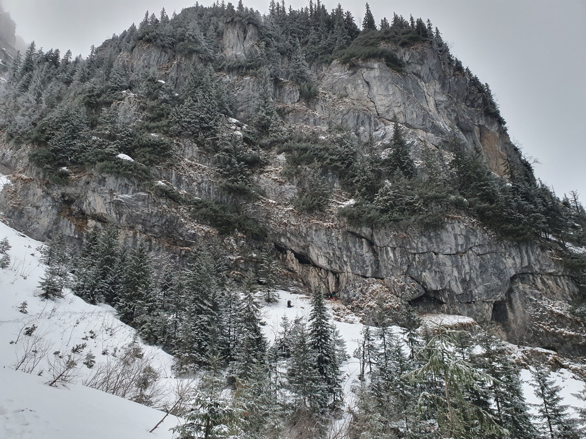
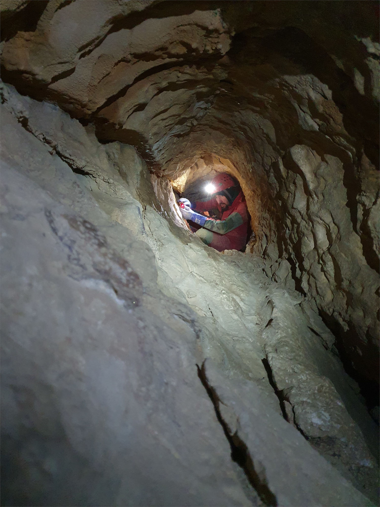
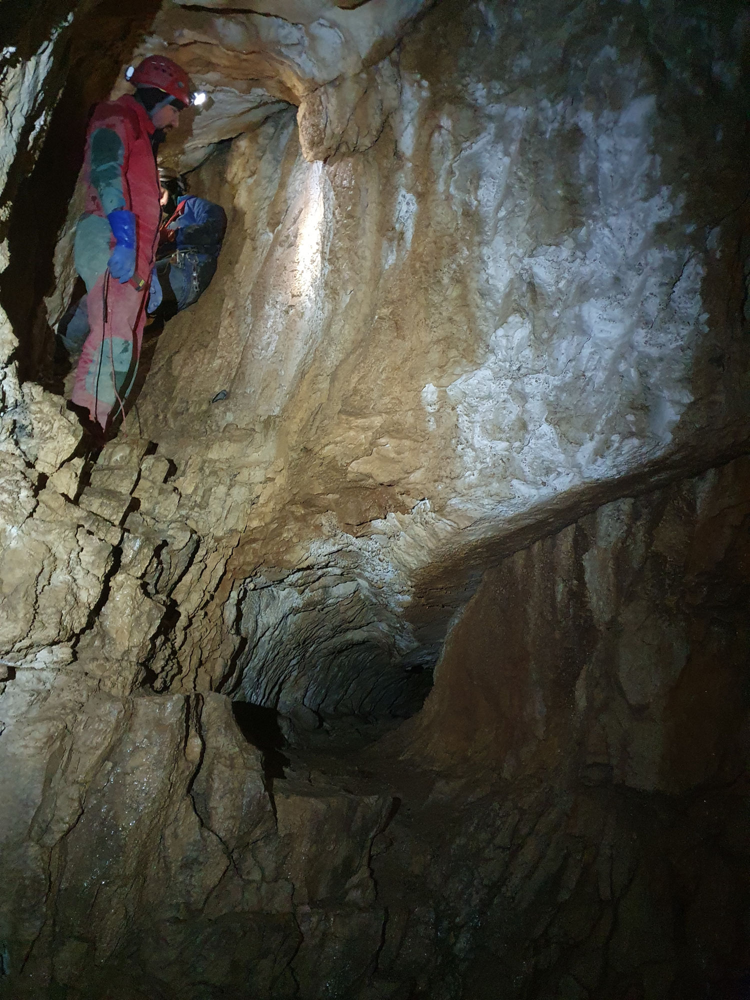
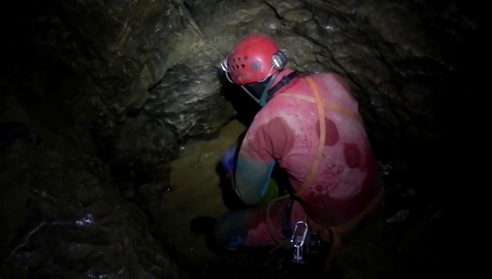
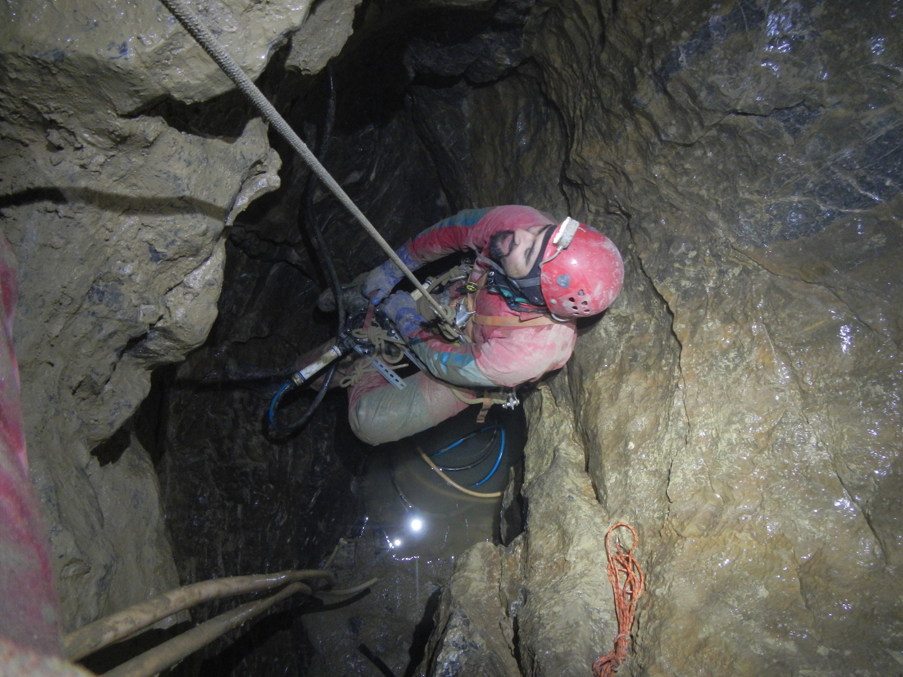
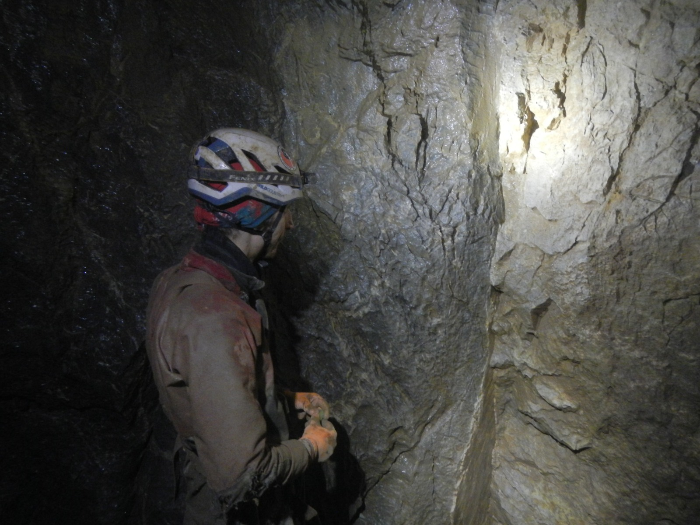

# Jaskinia Miętusia Wyżnia

__Opis na podstawie danych Państwowy Instytut Geologiczny - Państwowy Instytut Badawczy__

Zmiany opisu i redakcje (CC BY SA 4.0) wykonał Radost Waszkiewicz - Speleoklub Warszawski

Opis ciągu głownego normalnym tekstem, _boczne partie italiką_, rzadko odwiedzane partie zwinięte w blokach.

-----------------------------------------------------------------

## Otwór

<figure class="inline end" markdown>
  {width="400", align=left}
  <figcaption>Otwór. (2024-02-13, fot. Jan Grzeszek - Speleoklub Warszawski - CC BY SA 4.0)</figcaption>
</figure>

Otwór o wymiarach 5x2 m przedzielony w lewej części filarem skalnym znajduje się w ścianie około 4,5 m od jej podnóża (III+). Dojście łatwe (poza prożkiem III+), zwiedzanie jaskini uciążliwe ze względu na liczne zaciski i ciasne korytarze, wymaga użycia sprzętu wspinaczkowego.

Z komory przy otworze ciasnym przełazem w dół przedostajemy się do prostopadłego korytarza biegnącego w lewo (or.). Po kilku metrach korytarz skręca w prawo. Tu w lewo do tyłu odchodzi ciasny korytarzyk wracający do komory przy otworze. Dalej korytarz prowadzi ku N, następnie skręca w lewo (or.) i po 2 m znowu w prawo, wyraźnie się zwężając. Po około 20 m dochodzimy do małego prożka opadającego w dół, na którym korytarz rozwidla się. W lewo, poprzez 1,5-metrowy prożek, biegnie ku zachodowi ciasny, rurowy korytarzyk (Mylna Rura) łączący się po ponad 20 m z głównym ciągiem.

<figure class="inline end" markdown>
  {width="400", align=left}
  <figcaption>Mylna Rura. Na zdjęciu Michał Smaga w trakcie pomiarów. (2024-02-13, fot. Jan Grzeszek - Speleoklub Warszawski - CC BY SA 4.0)</figcaption>
</figure>

Na wprost główny ciąg prowadzi przez dwa kolejne progi w górę (1,5 i 3,0 m) ponad ciasną studzienką w dnie korytarza między progami. Idąc ciągle pod górę przechodzimy zakręt w prawo i w lewo (or.). Korytarz jest tu rozmyty na dwóch poziomach, tworząc charakterystyczne, ciemne rury. Około 8 m dalej mijamy otwierającą się pod lewą (or.) ścianą ciasną studnię (6,5 m głębokości), a następnie otwór studni 7 m głębokiej. Po dalszych 6 m dochodzimy do komory zwanej Salą Matki Boskiej.

## Sala Matki Boskiej

Sala Matki Boskiej stanowi system progów opadających w dół o łącznej deniwelacji około 12 m. W górnej części dochodzi do niej opisana uprzednio Mylna Rura, a w jej SE skraju otwiera się stromo nachylony komin (III-IV) wyklinowujący się ok. 34 m wyżej.

Poniżej Sali Matki Boskiej w prawo odchodzi opadający w dół szczelinowy korytarzyk, główny ciąg biegnie początkowo na wprost ku W, a następnie skręca w prawo i opada w dół (głębokość –18,1 m w stosunku do otworu). Dalej korytarz lekko się wznosi i po ok. 10 m skręca ku W. Szczelinowy, dość obszerny korytarz biegnie lekkim łukiem w lewo, a następnie skręca pod ostrym kątem w prawo. Tuż za zakrętem, w lewej ścianie otwiera się 4 m kominek. Nieco dalej korytarz ponownie skręca w lewo. Za zakrętem odchodzi w prawo ciasna szczelina. Korytarz skręca łagodnie w prawo i lekko opada doprowadzając do rozwidlenia. 

<figure class="inline end" markdown>
  {width="400", align=left}
  <figcaption>Sala Matki Boskiej. Na zdjęciu Michał Smaga w Górnym Obejściu, na wprost widoczny koniec Mylnej Rury. (2024-02-13, fot. Jan Grzeszek - Speleoklub Warszawski - CC BY SA 4.0)</figcaption>
</figure>

Główny ciąg biegnie prosto ku W, natomiast w lewo, ku S odchodzi korytarz przechodzący po 12 m w studnie, sprowadzające około 30 m niżej (Suche Dno).

Kilka metrów dalej, w prawej ścianie, otwiera się szczelinowy korytarzyk o długości prawie 20 m. Prowadzący dalej ku W korytarz główny ciągu podnosi się stromo do góry i rozszerza się w niewielką komórkę. Ku zachodowi opada zablokowana rumoszem ciasna szczelina, natomiast dalsza droga prowadzi przez skalną barierę o wysokości 2,5 m ku SW. Niski, szczelinowy korytarz nieco opada i skręcając lekko w prawo doprowadza po kilkudziesięciu metrach do niewielkiego rozszerzenia. Tu rozszerza się on i zmienia charakter. Ma kształt rury, w stropie widoczne są wymyte przez wodę belemnity (Rura). Korytarz wznosi się ku zachodowi. Kilka metrów za zakrętem w lewej (or.) ścianie otwiera się otwór Studni Nad Syfonami. W tym miejscu główny ciąg rozwidla się.

## Studnia Nad Syfonami

Studnia Nad Syfonami poprzez dwa progi o łącznej wysokości ok. 10 m sprowadza nad mały, Błotny Syfonik. Najciaśniejsze miejsce syfoniku jest bardzo ciasne - wymaga ustawienia głowy w bok żeby zmieścić kask.

<figure class="inline end" markdown>
  {width="400", align=left}
  <figcaption>Błotny Syfonik. Na zdjęciu Michał Smaga w wybiera wodę z syfonika dry bagiem. (2024-02-15, fot. Paweł Jarosz - Speleoklub Warszawski - CC BY SA 4.0)</figcaption>
</figure>

??? "Wybieranie wody z Błotnego Syfonika"
    ## Wybieranie wody z Błotnego Syfonika
    3 osobowy zespół wybierał wodę w zimie 2024 przez 2 godziny przy użyciu następującego sprzętu: 2 worki transportowe, 2 dry bagi, 15 metrów liny. 
    Jedna osoba wyciąga przygotowane wory przez szczelinę znajdującą się około metr od odejścia do Studni Nad Syfonami w kierunku zachodnim, spit nad szczeliną nie jest przydatny. Wodę można wylewać w kierunku zachodnim.
    Druga osoba pakuje dry bagi wypełnione wodą do worów, a trzecia osoba napełnia dry bagi wodą.

??? "Lewarowanie Błotnego Syfonika do przodu"
    ## Lewarowanie Błotnego Syfonika do przodu
    Od 2024 r. możliwe jest syfonowanie Błotnego Syfonika do przodu przy użyciu pozostawionych tam rur. 
    Do wystartowania systemu potrzebna jest membranowa pompa zęzowa, którą podłącza się do przygotowanych złączy kłowych geka na końcu węży. W drodze powrotnej możliwe jest odpalenie tego samego lewaru zaciągając wodę ustami (małe przewyższenie).

Za nim korytarz opada 4-metrowym progiem, za którym w obniżeniu korytarza blokuje dostęp następny, mały syfon – Syfonik Paszczaka. Syfonik jest ciasny - po opróżnieniu wymaga położenia się w błocie i ma około 4 m długości.
Syfon jest zakończony gliniastą groblą o wysokości około 1.5 m płynnie przechodzącą w stromo opadający freatyczny korytarz o litm spągu (Pochylnie).

??? "Lewarowanie Syfonika Paszczaka do przodu"
    ## Lewarowanie Syfonika Paszczaka do przodu
    Od 2024 r. możliwe jest syfonowanie Syfonika Paszczaka do przodu przy użyciu pozostawionych tam rur. 
    Do wystartowania systemu potrzebna jest membranowa pompa zęzowa, którą podłącza się do przygotowanych złączy kłowych geka na końcu węży. Nie możliwe jest opalenie tego systemu bez pompy (do pokonania jest około 1.5 m przewyższenia) zarówno w kierunku do przodu jak i w drodze powrotnej.
    W drodze powrotnej dodatkowy krótrzy wąż umożliwia wystartowanie dodatkowego lewaru Syfonika Paszczaka od dalszej od wejścia strony -- to również jest możliwe tylko przy użyciu pompy (1.5 m przewyższenia).

<figure class="inline end" markdown>
  {width="400", align=left}
  <figcaption>Między syfonami. Na zdjęciu Michał Smaga wypompowuje wodę z dolnego syfonika. (2024-02-16, fot. Paweł Jarosz - Speleoklub Warszawski - CC BY SA 4.0)</figcaption>
</figure>

Poniżej niego schodzimy I i II Pochylnią do syfoniku Salome. W 2024 r. syfonik Salome w bardzo mokry dzień był tylko kałużą. 
Dalej poprzez kruchy korytarzyk dochodzimy nad I studnię (spit w suficie). Trawersując nad I Studnią osiągamy zawaliskową platformę, za którą 5-metrowy pionowy próg sprowadza nad następny, stromy próg o wysokości 8 m. 
Kilka metrów dalej za skalnym mostem otwiera się przed nami II studnia, którą trawersujemy po prawej (or.) stronie po czym zjeżdżamy do dna.
Obszerne wypłaszczenie z gładką południową ścianą pozwala na wygodną obserwację widowiskowego styku tektonicznego wapieni malmu (bajos, jaśniejsze) z utworami triasu środkowego (ciemniejsze). 

Wracamy nad I Studnię. Zjeżdżamy nią 30 m na pokrytą rumoszem platformę i z niej następne 13 m w dół II Studnią. Stąd korytarz opada stromo do piaszczystego zagłębienia. Stąd prowadzi w górę ciasny przekop w zawalisku, ostatecznie blokującym drogę po ok. 4 m.

<figure class="inline end" markdown>
  {width="400", align=left}
  <figcaption>Dno jaskini. Na zdjęciu Radost Waszkiewicz oświetla styk tektoniczny. (2024-02-15, fot. Paweł Jarosz - Speleoklub Warszawski - CC BY SA 4.0)</figcaption>
</figure>

## Problem Speleoklubu

Wracamy do rozwidlenia ciągów nad Studnią Nad Syfonami. Korytarz biegnie prosto ku SWW, dno jest pokryte mułem. Pod ścianą rozlewa się duża kałuża. Po skręcie w lewo korytarz podnosi się, a następnie skręca w prawo. Po ok. 40 m dochodzimy do zamulenia, zamykającego dalszą drogę.

??? "Speleogeneza i geologia"
    ## Speleogeneza i geologia
    Jaskinia utworzyła się w utworach wapiennych triasu środkowego i malmu serii wierchowej fałdu Czerwonych Wierchów, w obrębie antykliny Upłazu Miętusiego (Grodzicki 1978) – podrzędnego elementu tektonicznego jednostki Organów. Założenia tektoniczne korytarzy są bardzo wyraźne, liczne korytarze szczelinowe są tylko nieznacznie zmodyfikowane oddziaływaniem wód przepływających pod ciśnieniem (Grodzicki 1969,1970). Wszyscy autorzy badający jaskinie tatrzańskie są zgodni co do trzeciorzędowego wieku Jaskini Miętusiej Wyżniej – J. Rudnicki (1958,1967), Z. Wójcik (1966a, 1968), J. Grodzicki (1969, 1970, 1978a). Występują w niej liczne, współczesne przesunięcia na szczelinach tworzących korytarze (Wójcik, Zwoliński – 1959, Grodzicki – 1969, 1970, 1979a) . Widoczny jest też kontakt tektoniczny wapieni malmu (bajos) z utworami triasu środkowego. Wzdłuż tego kontaktu rozwinęła się większość korytarzy jaskini – cały dolny ciąg oraz główny od Sali Matki Boskiej do Studni Nad Syfonami. Na kontakcie woda w kilku miejscach wypreparowała ze skały belemnity (w Rurze oraz I Studni).

    Osady mulisto-ilaste występują w końcowym odcinku głównego ciągu (Za Studnią Nad Syfonami). Dominują w całej jaskini zawaliska i gruz wapienny. Osady badał Z. Wójcik (1966a). Podaje on, że dominującym osadem są zwietrzałe mułowce, które niekiedy przybierają charakter cementacyjnych konkrecji. Ponadto pospolity jest tu gruz wapienny oraz rezydualne iły zmieszane z mułem i piaskiem.

    Światło sięga do obniżenia w komorze przy otworze. Jaskinia jest wilgotna, woda kapie ze szczelin w stropie. Występują małe jeziorka, głównie jako błotniste syfony w dolnym ciągu. Strefa wymarzania sięga aż do Sali Matki Boskiej. Wyczuwa się silny przewiew między otworem a 34-metrowym kominem. K. Kowalski (1953a) podaje, że temperatura mierzona 30 czerwca 1950 r. wynosiła w tej sali +3°C, a przy końcu jaskini +3,7°C w powietrzu, a +3,5°C w wodzie.

    W przyotworowej komorze występują nieliczne rośliny kwiatowe oraz mchy i porosty. T. Bielska wymienia następujące gatunki roślin zebranych 12 lipca 1980 r.:

    kwiatowe – Leontopodium alpinum Cass.,Primula auricula L., Festuca versicolor Tausch., Trisetum alpestre P.B.;

    paproć – Cystopteris fragilisBernh.

    mszaki – Eurhynchium swartzii Hobkirk, Encalypta contorta Lindb., Cratoncurum filicinum Roth., Bryum ventricosum Dicks., Distichium Montanum Hag., Marchantia polymorpha L., Tortula montana Lindb., Barbula rigidula Mitt. (syn. Didymodon rigidulus).

    W korytarzach za otworem skupia się bogaty zespół trogloksenów. Kowalski (1955a) wymienia troglofila Onychiurus armatus (Tullberg). Faunę nietoperzy i innych ssaków zbadał K. Kowalski (1953a,c,1955a) oraz A. Skalski (1970). W namuliskach i zawalisku występują liczne kości nietoperzy, gryzoni i kuny. W końcowym korytarzu i w pobliżu otworu znaleziono całe szkielety kuny (Martes martes), a w kominach czaszkę łasicy (Mustela nivalis – Kowalski 1953a). A. Skalski (1970) wymienia następujące gatunki: Myotis mystacinus, Myotis bechsteinii, Myotis myotis, Myotis nattereri, Myotis dasycneme, Myotis daubentonii, Plecotus auritus, Barbastella barbastellus, Eptesius nilssonii, Talpa europaea, Sorex alpinus, Pitymus tatricus, Sicista betulina.

    Piksa i Wołoszyn (2001) – Myotis myotis, Myotis bechsteinii, Myotis nattereri, Myotis mystacinus /Leisler/, Myotis brandtii, Myotis dasycneme, Myotis daubentonii, Eptesicus nilssonii. Nowak i in. (2001) opisują Myotis dasycneme, a Piksa i Nowak (2001)notują występowanie Barbastella barbastellus.
